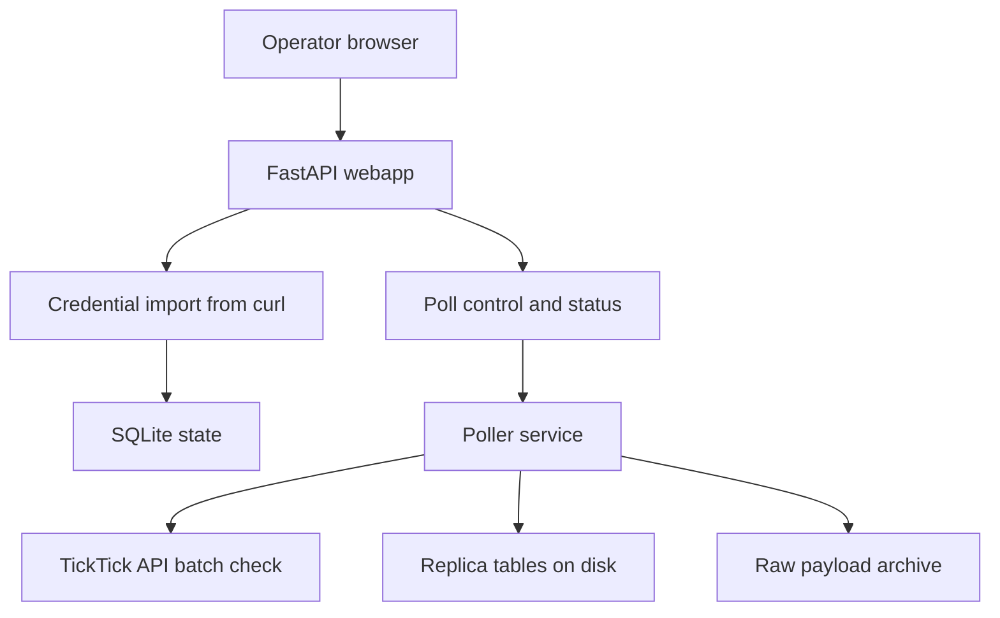

# TickTick v3 Poller

This module implements a disk-backed TickTick v3 replica using SQLModel + Pydantic, plus a minimal FastAPI operator webapp for no-SSH operations behind Traefik.

## Project Context (Why This Exists)

The broader platform goal is GTD-driven decision support with perceptual real-time feedback. TickTick has no webhook path for this use case, so v3 is built around high-frequency polling of the browser-session sync endpoint.

Primary objective for this module:
- keep a durable local replica that can be merged quickly from TickTick deltas
- expose simple operator controls so profile refresh and poll operations do not require SSH

## Local Architecture (How v3 Works)



Core merge semantics implemented from payload discovery:
- `syncTaskBean.update[]` -> upsert `taskreplica`
- `syncTaskBean.delete[]` -> delete from `taskreplica`
- `projectProfiles` non-null -> full-replace `projectreplica`
- `projectGroups` non-null -> full-replace `groupreplica`
- checkpoint advances after state write (checkpoint-last durability)

## Code Ownership Map

- `poller/models.py`: SQLModel table schema (single source of DB truth)
- `poller/schemas.py`: Pydantic contracts (payload and API DTOs)
- `poller/repository.py`: persistence and query helpers
- `poller/service.py`: polling orchestration and merge flow
- `poller/webapp.py`: Pass A operator API and simple HTML page
- `poller/main.py`: CLI entrypoint

## Quick Start

1. Install dependencies:

```bash
uv sync
```

2. Initialize DB schema:

```bash
python -m EL.ticktick.v3.poller.main init-db
```

3. Capture browser `copy as curl` into local file (see `config/ticktick_check.curl.example`).

4. Import active profile:

```bash
python -m EL.ticktick.v3.poller.main import-curl --curl-file EL/ticktick/v3/config/ticktick_check.curl
```

5. Run one poll cycle:

```bash
python -m EL.ticktick.v3.poller.main poll-once
```

6. Run loop mode:

```bash
python -m EL.ticktick.v3.poller.main poll-loop --interval 30
```

7. Run operator webapp (Traefik target):

```bash
python -m EL.ticktick.v3.poller.main serve-webapp --host 0.0.0.0 --port 8000
```

Then open `http://<host>:8000/` or your Traefik route.

## Data and Runtime Paths

- SQLite replica DB: `EL/ticktick/v3/data/ticktick_replica.db`
- Raw payload archive: `EL/ticktick/v3/data/raw_batches/`
- Curl template: `EL/ticktick/v3/config/ticktick_check.curl.example`

## Database Tables

- `credentialprofile`: active browser session profile
- `pollerlease`: single-writer lock with TTL
- `checkpointstate`: durable checkpoint and health state
- `taskreplica`: task replica rows
- `projectreplica`: project replica rows
- `groupreplica`: group replica rows
- `pollcycle`: per-cycle telemetry

## Current Operational Notes

- Raw payload archive is currently append-only; retention bounds are the next hardening step.
- Pass A webapp is intentionally minimal and currently assumes network-level protection via Traefik/private routing.