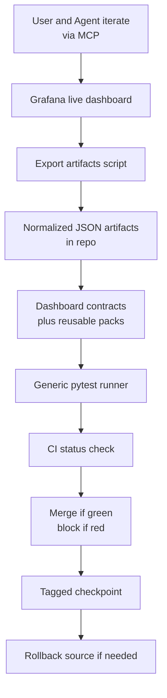
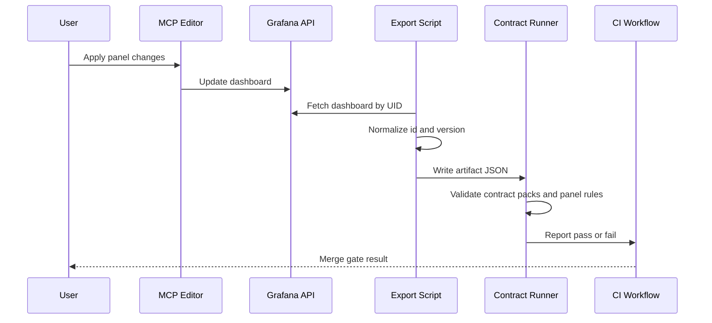
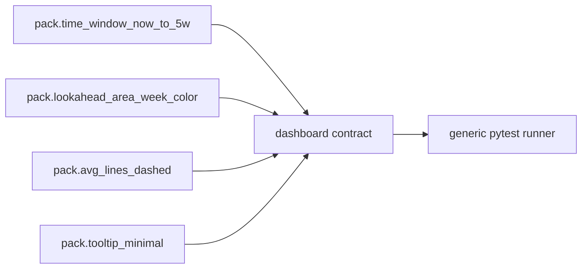
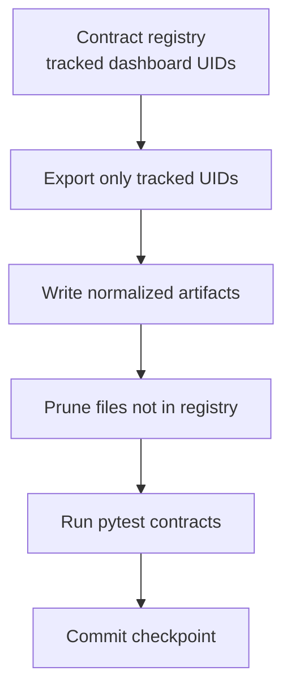
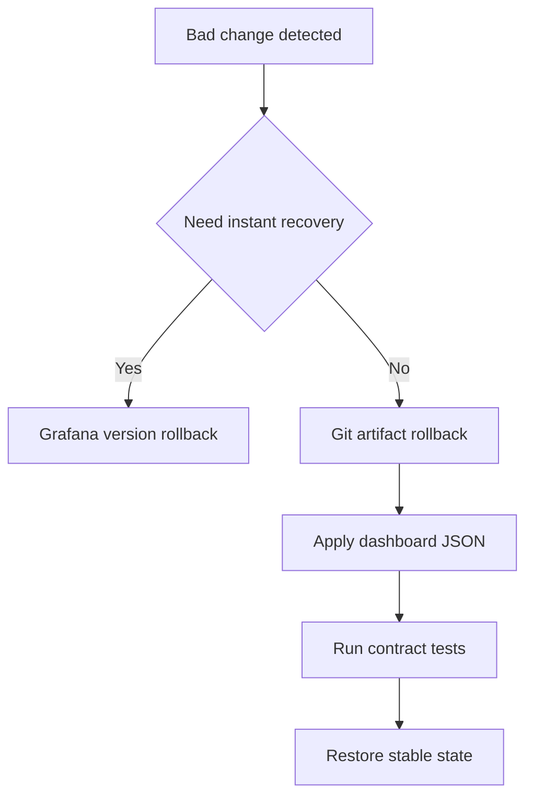

# Grafana Guardrails and Contract Testing Philosophy

## Purpose

This document defines how we prevent Grafana dashboard regressions at scale without writing one-off scripts per chart.

Primary goal:
- keep dashboard UX and semantics stable as panels evolve rapidly through MCP-assisted editing.

Secondary goals:
- make intent understandable to future maintainers one year later,
- provide one-command validation similar to `pytest`,
- keep rollback safe and fast.

## Problem Statement

Grafana iteration is fast, but fast edits can regress hard-won UX details:
- time window can silently drift and reintroduce blank-space noise,
- color contracts can break and destroy visual semantics,
- tooltip behavior can regress into noisy or unreadable output,
- ad hoc checks become unmaintainable when dashboard count grows.

We need contract-as-data, not ad hoc script-as-logic.

## Design Principles

1. Declarative over bespoke
- Store expected behavior in contract files, not panel-specific Python scripts.

2. Reusable packs over copy-paste
- Compose chart contracts from shared packs such as `time_window_compact`, `lookahead_week_color`, `avg_lines_dashed`.

3. One runner, many contracts
- A single generic test runner validates all dashboards and panels.

4. Explain why, not only what
- Every critical rule includes rationale fields so future maintainers understand intent.

5. CI gate plus lightweight visual review
- CI enforces objective invariants; humans verify subjective aesthetics.

6. Safe rollback is first-class
- Every accepted state is reproducible from Git artifacts.

## System Entities and Their Synergy

| Entity | Responsibility | Output | Consumer |
|--------|----------------|--------|----------|
| Grafana MCP tools | Live authoring and rapid iteration | Updated dashboard in Grafana | Export pipeline |
| Grafana API export script | Normalize and persist artifacts | `grafana/dashboards/<folder>/<uid>.json` | Contract runner, Git history |
| Contract packs | Reusable assertions for common patterns | Shared rulesets | Dashboard contract files |
| Dashboard contracts | Panel-level intent and invariants | Declarative expectations | Generic pytest runner |
| Generic contract runner | Validate artifacts and optionally live API state | Pass or fail report | CI and local developers |
| CI workflow | Enforce merge gate | Required status check | Pull request process |
| Rollback utility | Restore known good dashboard JSON | Re-applied dashboard state | Incident recovery |

## End-to-End Lifecycle





## Contract Semantics

### Core Philosophy

A contract must express both:
- machine-checkable invariants,
- human-readable rationale.

### Contract Shape

```yaml
version: 1
owner: data-platform

dashboard:
  uid: gtd-main-tasks-v3
  title: GTD Main Tasks v3

uses:
  - pack.time_window_now_to_5w
  - pack.lookahead_area_week_color
  - pack.avg_lines_dashed
  - pack.tooltip_minimal

annotations:
  rationale: >
    Lookahead is a short tactical horizon. Wide ranges such as now to plus 90 days
    compress meaningful data and hide workload shape.
  anti_regression_story: >
    Historical regressions introduced empty canvas before and after actual data,
    which reduced scan speed and planning quality.
  decision_refs:
    - LOG-034
    - LOG-035
  sunset_condition: >
    Replace this fixed range only when panel-level auto-domain is implemented
    without inheriting dashboard-wide long horizons.

panels:
  - id: 1
    alias: tasks_lookahead
    checks:
      - id: panel_type
        selector: panel.type
        op: equals
        expected: timeseries
        severity: error
        rationale: Area flow is required for trend readability.

      - id: dashboard_time_window
        selector: dashboard.time
        op: equals
        expected:
          from: now
          to: now+5w/w
        severity: error
        rationale: Prevent blank-space regression.

      - id: query_contains_5_week_bounds
        selector: panel.target[0].rawSql
        op: contains_all
        expected:
          - CURRENT_DATE() AS start_date
          - INTERVAL 5 WEEK
          - week_num <= 5
        severity: error

      - id: series_present
        selector: panel.target[0].rawSql
        op: contains_all
        expected:
          - AS W1
          - AS W2
          - AS W3
          - AS W4
          - AS W5
          - AS `Week Avg`
          - AS `Global Avg`
        severity: error

      - id: global_avg_contrast
        selector: panel.overrides.Global Avg.color
        op: not_equals
        expected: '#FFFFFF'
        severity: error
        rationale: White line blends into light backgrounds.

      - id: avg_rounding
        selector: panel.target[0].rawSql
        op: contains_all
        expected:
          - CAST(CEIL(AVG(daily_tasks)) AS INT64)
        severity: error
        rationale: Tooltip should show integer averages.
```

## Reusable Pack Model

Use packs to avoid duplicating logic across dashboards.



Suggested pack categories:
- Time window packs
- Chart encoding packs
- Color and accessibility packs
- Tooltip behavior packs
- Data-shape query packs

## One-Command Execution Model

Local run:

```bash
uv sync --group dev
uv run --group dev pytest tests/grafana -q
```

CI run:
- same command,
- fails pull request on contract violation.

Recommended CI stages:
1. Export target dashboards from Grafana API.
2. Prune stale artifacts not in registry.
3. Run contract tests.
4. Publish readable failure report.

## Artifact Lifecycle and Hygiene

### Current Behavior

Current exporter writes deterministic UID-based files and normalizes volatile fields.
This gives stable diffs but does not automatically prune stale files.

### Recommended Lifecycle



Contract registry concept:
- file example: `grafana/contracts/registry.yaml`
- source of truth for which dashboards are actively managed.

Prune rule:
- remove artifact JSON files not present in registry,
- fail CI if unmanaged artifacts appear unexpectedly.

## Rollback and Backup Strategy

Use three layers of safety.

1. Fast rollback in Grafana UI
- useful for immediate undo while iterating.

2. Deterministic rollback from Git artifacts
- check out known-good dashboard JSON,
- apply via generic apply script,
- re-run contracts.

3. Checkpoint policy
- tag accepted UX milestones in Git,
- optional scheduled export snapshot for disaster recovery.



## MCP vs CI Responsibilities

| Capability | MCP | CI Contract Runner |
|------------|-----|--------------------|
| Live editing | Excellent | Not applicable |
| Rapid inspection | Excellent | Limited |
| Deterministic gate | Weak | Strong |
| Historical reproducibility | Medium | Strong with artifacts |
| Team-wide enforcement | Weak | Strong |

Policy:
- MCP is the authoring loop.
- CI contract runner is the merge gate.

## Maintainer Playbook

When editing a dashboard:
1. Make changes via MCP or Grafana UI.
2. Export artifacts for tracked UIDs.
3. Run contract tests locally.
4. Fix violations.
5. Commit artifacts and contract updates together.
6. Ensure CI passes before merge.

When adding a new dashboard:
1. Add UID to contract registry.
2. Compose dashboard contract from reusable packs.
3. Add only dashboard-specific overrides and rationale.
4. Verify with one-command test run.

When changing a long-lived invariant:
1. Update rule.
2. Update rationale annotation and decision refs.
3. Add migration note in changelog or work log.

## Glossary

| Term | Definition |
|------|------------|
| Contract pack | Reusable group of assertions applied to multiple dashboards |
| Dashboard contract | Declarative rule set for one dashboard and its panels |
| Registry | Explicit list of managed dashboard UIDs for export and pruning |
| Artifact | Normalized JSON representation of a dashboard committed to Git |
| Guardrail | A rule that prevents known regression classes |

## Reference Evidence

This philosophy aligns with current repository behavior:
- deterministic UID-path artifact writes,
- normalization of volatile dashboard fields,
- workflow-level targeted export and commit-on-change.

See:
- `grafana/scripts/export_grafana_artifacts.py`
- `.github/workflows/grafana_write_back.yml`
- `grafana/scripts/README.md`