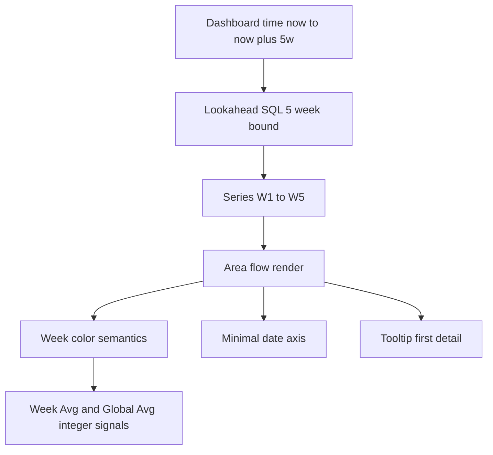
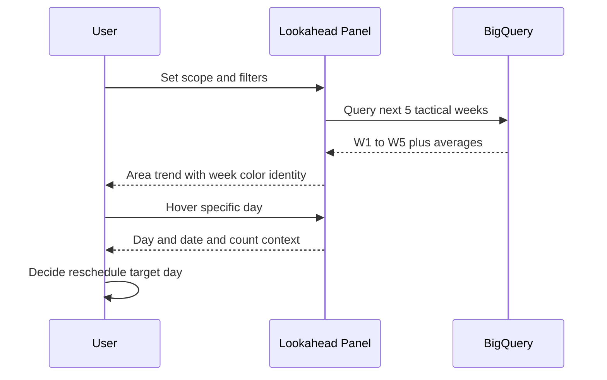

# Lookahead Chart Specification for GTD Main Tasks v3

## Status

- Status: Locked contract for PHASE-006 hardening
- Dashboard UID: `gtd-main-tasks-v3`
- Panel: `id=1` and title prefix `Tasks Lookahead`
- Canonical runtime artifact: `grafana/dashboards/gtd-migration/gtd-main-tasks-v3.json`
- Last validated: 2026-02-28

## Why This Chart Exists

This chart exists to support short-horizon planning decisions during active GTD review.

Primary planning use case:
- scan one week quickly,
- detect overloaded days,
- rebalance tasks into lighter days or lighter weeks.

Concrete operator question:
- if Friday in week 1 is overloaded, which exact days in week 2 to week 5 are lighter and can absorb moved tasks.

Secondary balancing use case:
- compare local week average against global average to check whether workload is distributed evenly across the next five-week horizon.

## User Experience Contract

### 1) Time Scope Contract

- Dashboard default time window must be compact and future-aware:
  - `from=now`
  - `to=now+5w/w`
- Lookahead SQL must independently enforce the same five-week tactical horizon.
- Negative-space behavior is forbidden:
  - no large pre-data or post-data blank canvas from broad windows such as year-to-date plus 90 days.

### 2) Visual Encoding Contract

- Panel type must be `timeseries`.
- Rendering must be area-flow style for continuity and trend scanning.
- Day-to-day shape must be visible as a flow without coarse bar spacing.

### 3) Color Semantics Contract

- Color encodes week bucket identity, not weekday identity.
- One week bucket equals one fixed color series.
- All seven weekdays in the same week share the same week color.
- Day distinction is carried by value and relative shape, not by per-weekday color.

Required week series:
- `W1`
- `W2`
- `W3`
- `W4`
- `W5`

### 4) Average Signal Contract

- `Week Avg` and `Global Avg` are contextual reference signals.
- Average values must be integer-rounded using ceiling behavior.
- Tooltip display for averages must show integer values.

### 5) Axis and Tooltip Contract

- X axis must remain minimal and date-oriented.
- Long composite labels such as `W1 Fri 02/27` are not allowed on axis labels.
- Detail belongs in tooltip.

Tooltip goals:
- compact,
- informative,
- zero-noise.

Tooltip should prioritize:
- day context,
- short date context,
- value context.

### 6) Filter and Scope Contract

Lookahead query must respect dashboard controls:
- `scope_bucket`
- `folder_name`
- `project_name`

Lookahead query must aggregate from:
- `airbyte-468412.ticktick_dbt_prod.fct_tasks_v3_due_workload_daily`

## Superseded Assumption

Superseded rule from earlier planning draft:
- "weekday-fixed colors across all weeks" is deprecated for this chart.

Current authoritative rule:
- week-fixed colors, with day differences represented by value and shape.

## Contract Anatomy

## Data and Query Contract Snapshot

The panel query must include these semantic anchors:
- `CURRENT_DATE() AS start_date`
- `INTERVAL 5 WEEK`
- `week_num <= 5`
- `CAST(CEIL(AVG(daily_tasks)) AS INT64)`
- `AS W1` to `AS W5`
- `AS `Week Avg``
- `AS `Global Avg``

## Source of Truth References

| Source | Reference | Why it matters |
|--------|-----------|----------------|
| Runtime artifact | `grafana/dashboards/gtd-migration/gtd-main-tasks-v3.json` | Canonical exported dashboard state in Git |
| Dashboard time window | JSONPath `$.time` | Enforces compact tactical horizon |
| Lookahead panel type | JSONPath `$.panels[] | select(.id==1) | .type` | Guarantees area-flow timeseries renderer |
| Lookahead SQL | JSONPath `$.panels[] | select(.id==1) | .targets[0].rawSql` | Encodes data scope and five-week logic |
| Lookahead overrides | JSONPath `$.panels[] | select(.id==1) | .fieldConfig.overrides` | Encodes week color and average styling |
| Tooltip behavior | JSONPath `$.panels[] | select(.id==1) | .options.tooltip` | Preserves minimal informative hover behavior |
| Process guardrails | `docs/grafana/grafana-guardrails-contracts.md` | Defines reusable CI and lifecycle model |

## Acceptance Checklist

| ID | Check | Pass criteria |
|----|-------|---------------|
| L1 | Time horizon compactness | Dashboard window equals now to now plus 5w week boundary |
| L2 | Five-bucket scope | Query bound includes exactly tactical five-week logic |
| L3 | Renderer continuity | Panel type is timeseries and area-flow style is active |
| L4 | Week color semantics | W1 to W5 each has stable identity color |
| L5 | Day discrimination | Variation is visible through local shape and value |
| L6 | Average contextualization | Week Avg and Global Avg exist and are integer rounded |
| L7 | Tooltip readability | Tooltip is concise and does not flood with zero-noise entries |
| L8 | Filter coupling | Scope and folder and project filters affect panel query |

## Change Policy

Any change to this chart must update three artifacts together:
- live dashboard via MCP or Grafana UI,
- exported dashboard JSON artifact,
- this specification if behavior semantics changed.

If behavior changes without spec change, treat it as drift.

## Regression Signatures to Watch

- X axis returns long concatenated labels.
- Global window drifts back to year-to-date plus 90 days.
- Color mapping shifts from week identity to weekday identity.
- Averages show non-integer values in tooltip.
- Lookahead series become sparse bars instead of area flow.

## Related Documents

- Guardrail framework and CI philosophy:
  - `docs/grafana/grafana-guardrails-contracts.md`
- Session log that locked this chart contract:
  - `gsd-lite/WORK.md` entry `LOG-036`

## Example Data Walkthrough

This example demonstrates why week-color area flow plus average lines is useful for fast rebalancing.

Sample daily counts across five tactical weeks:

| Week | Mon | Tue | Wed | Thu | Fri | Sat | Sun | Week total | Week Avg rounded up |
|------|-----|-----|-----|-----|-----|-----|-----|------------|---------------------|
| W1 | 2 | 3 | 4 | 3 | 8 | 1 | 1 | 22 | 4 |
| W2 | 1 | 1 | 2 | 1 | 2 | 0 | 0 | 7 | 1 |
| W3 | 0 | 1 | 2 | 1 | 1 | 0 | 0 | 5 | 1 |
| W4 | 1 | 1 | 1 | 2 | 1 | 0 | 0 | 6 | 1 |
| W5 | 0 | 0 | 1 | 1 | 0 | 0 | 0 | 2 | 1 |

Global average across all days in five weeks:
- raw average about 1.2 tasks per day
- displayed `Global Avg` equals `2` after ceiling integer rounding

Planning interpretation:
- W1 Friday at 8 is overloaded versus local week context and global baseline.
- W2 to W5 have multiple low-intensity days.
- Action: move one to two tasks from W1 Friday into lighter target days, preserving realistic workload shape.

Why this requires current UX contract:
- week-fixed colors maintain bucket identity while scanning left-to-right,
- area continuity reveals trend and troughs faster than sparse bars,
- compact time window prevents empty-canvas distortion,
- tooltip detail confirms exact day and date before moving tasks.