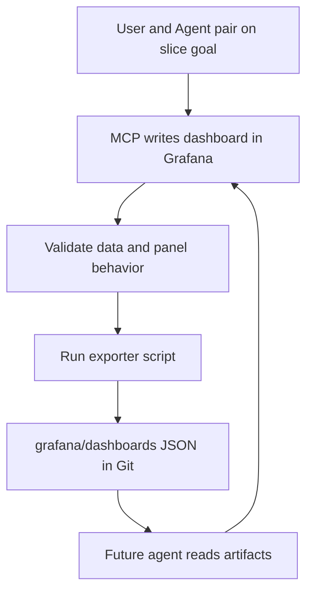
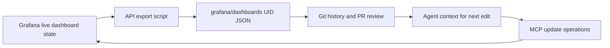
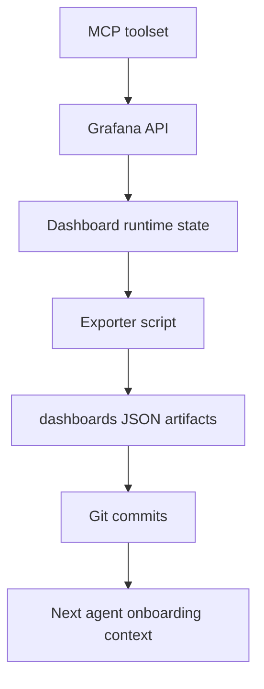
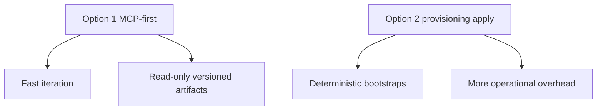

# Grafana MCP Workflow

This directory supports an MCP-first dashboard workflow.

Primary goal: keep a read-only, versioned record of dashboard shape in Git while agents and humans build dashboards live in Grafana via MCP.

## Directory Layout

- `dashboards/`: exported dashboard JSON artifacts (source of history for dashboard shape)
- `scripts/`: exporter script and local tooling docs
- `provisioning/`: optional files for file-provisioning/GitOps apply flows (not required for day-to-day migration work)

## Canonical Workflow (Current)

1. Pair on dashboard changes in Grafana via MCP tools.
2. Validate panel correctness in Grafana.
3. Export dashboard JSON to this repo (`grafana/dashboards/...`).
4. Commit artifacts so future agents can read shape/history.
5. Next agent reads artifacts and continues building via MCP.



## Artifact Lifecycle

- Live dashboard is the execution surface.
- Exported JSON is the memory surface.
- MCP is the mutation path.
- Git is the audit path.



## How Artifacts Work Together

- `dashboards/*.json`
  - Captures structure, queries, panels, and layout by UID.
  - Used by agents to reconstruct intent and avoid starting blind.
- `scripts/export_grafana_artifacts.py`
  - Pulls dashboard definitions from Grafana API.
  - Normalizes volatile fields for stable diffs.
- `provisioning/*` (optional)
  - Only needed if you also want file-provisioned apply behavior.
  - Not required for MCP-first migration execution.



## Runtime Options

### Option 1 (Recommended now): MCP-first + Read-only Git Export

- Write path: MCP
- Record path: exporter script -> `grafana/dashboards`
- Apply-from-Git: not required

### Option 2 (Optional later): Provisioning/GitOps Apply

- Write path: JSON/provisioning files
- Apply path: Grafana file provisioning
- Record path: same Git repo



## Export Commands

From `grafana/scripts`:

```bash
uv run python export_grafana_artifacts.py
```

Export selected dashboards only:

```bash
uv run python export_grafana_artifacts.py --dashboard-uids gtd-weekly-review-v3
```

Include optional provisioning snapshots:

```bash
uv run python export_grafana_artifacts.py --include-providers --include-datasources
```

## Practical Rules

- Treat `grafana/dashboards` as the canonical artifact history for dashboard shape.
- Use stable dashboard UIDs to keep continuity across edits.
- Avoid manual JSON edits unless necessary; prefer MCP updates then export.
- Keep temporary smoke/demo dashboards out of committed artifacts unless intentionally preserved.