# GSD-Lite Work Log

---

## 1. Current Understanding (Read First)

<current_mode>
planning
</current_mode>

<active_task>
- Finalize implementation plan for v3 poller + operator webapp (SQLite lease, SQLModel, Pydantic, Traefik)
</active_task>

<parked_tasks>
- Dashboard hosting location (EU vs Asia/Homelab)
- Snapshot pipeline refactor
</parked_tasks>

<vision>
Personal data platform for GTD-driven life decisions. The goal is "perceptual real-time" (~30s latency) so the dashboard feels live during planning sessions. Since webhooks don't exist, we must rely on high-frequency polling.
</vision>

<decisions>
- DECISION-001: Priority order is A (data freshness) > B (query latency) > D (architecture consolidation).
- DECISION-002: Snapshot-based completion tracking is mandatory (API data loss).
- DECISION-003: No webhooks exist; polling is the only path forward.
- DECISION-004: Canonical extraction path is unofficial browser-session sync with checkpoint deltas (`/api/v3/batch/check/{checkPoint}`) using spoofed user-agent and `t` cookie.
- DECISION-005: LOG-003, LOG-004, LOG-005 are deprecated as conflicting exploratory drafts; LOG-006 is authoritative.
- DECISION-006: Phase-1 merge contract prioritizes entity state (`syncTaskBean`, `projectProfiles`, `projectGroups`); `sync*Order*` is deferred from normalized replica.
- DECISION-007: Concurrency control will use single-writer lease on SQLite; stack standardizes on FastAPI + SQLModel + Pydantic.
- DECISION-008: Orchestration remains lightweight now; Dagster deferred until operational complexity justifies it.
</decisions>

<blockers>
- ~~Need targeted capture set (6-8 actions) to increase confidence on payload variance coverage.~~ RESOLVED: LOG-014
- Remaining capture gaps (low-medium risk): tag add/remove, project hard delete (disappear semantics suspected but unconfirmed)
</blockers>

<next_action>
Proceed to schema and endpoint scaffolding per LOG-013 plan — parser rules fully confirmed in LOG-014. Optionally capture tag add/remove + project hard delete to close remaining gaps.
</next_action>

---

## 2. Key Events Index (Project Foundation)

| Log ID | Type | Task | Summary |
|--------|------|------|---------|
| LOG-001 | VISION | - | Project initialization: Life Admin dbt platform vision captured |
| LOG-002 | DISCOVERY | PHASE-001 | No webhooks; polling required; unofficial endpoint dramatically faster |
| LOG-006 | DECISION | RECONCILE-LOGS | Authoritative spoofed-UA checkpoint-sync strategy established |
| LOG-012 | BREAKTHROUGH | TASK-002 | Learning detour resolved: server-owned cursor model + entity-first merge scope finalized |
| LOG-013 | PLAN | TASK-003 | Lightweight FastAPI operator control plane and poller plan (SQLite lease, SQLModel/Pydantic, Traefik) |
| LOG-014 | DISCOVERY | TASK-003 | Targeted capture matrix (11 actions): parser rules confirmed — task upsert, delete lane, `closed:true` archive, group disappear-diff semantics |

---

## 3. Atomic Session Log (Chronological)

### [LOG-001] - [VISION] - Project initialization and architecture mapping - Task: -

**Timestamp:** 2026-02-18
**Depends On:** None (first log)

---

#### Part 1: Vision Discovery

User shared the core problem: **wanting to add more data to day-to-day decisions** using the GTD (Getting Things Done) framework. The system maps to David Allen's 6 Horizons of Focus:

- **Ground:** Daily tasks (TickTick/Todoist)
- **Horizon 1:** Projects (multi-step commitments)
- **Horizon 2:** Areas of Responsibility (folders in TickTick)
- **Horizon 3:** 1-3 year goals (not yet modeled — qualitative)

Current data sources: TickTick (main GTD), Todoist (habits). Roadmap: YNAB (finances).

#### Part 2: Pain Points Identified

**Primary pain (Priority A): Data staleness**
- Current: 15-min batch pipeline, ~1 min extraction time (rate limited)
- Desired: Changes visible in seconds
- Use case: During GTD daily review, reschedule tasks and see updated distribution immediately

**Secondary pain (Priority B): Dashboard latency**
- Lightdash hosted on EU VM, user in Vietnam
- 8s query time in Lightdash vs 1s direct to BQ
- 15s dashboard load time
- Hypothesis: Network round-trip (EU ↔ Asia ↔ BQ asia-southeast1)
- Local Lightdash was snappy — homelab is viable fix

**Architecture pain (Priority D): Two-branch split**
- `main` branch: BQ models, Lightdash charts
- `incremental_run_gha` branch: TickTick snapshot pipeline (DuckDB)
- Hard to observe lineage, hard to test, snapshot models isolated

**Reproducibility pain (Priority C): Manual bootstrap**
- First deployment required manual bucket creation, schema setup
- Not reproducible for onboarding new sources (YNAB)

#### Part 3: Critical Dependency Discovered

**TickTick API limitation:** Completed tasks disappear from the endpoint — no completion metadata.

**Solution:** SCD2 snapshots infer completion:
- Task present → task absent = marked as done
- `dbt_valid_to` timestamp = completion time

**Risk:** Snapshot table is **irreplaceable source of truth**. Cannot rebuild from API. Current mitigation: GCS bucket persistence (backup not automated).

#### Part 4: Success Criteria Established

- [ ] Data freshness: TickTick changes visible in dashboard within **seconds**
- [ ] Query latency: Dashboard queries complete in <2 seconds
- [ ] Dashboard load: Initial load <5 seconds
- [ ] Pipeline observability: Data freshness indicator visible in dashboard
- [ ] Snapshot resilience: Historical completion data backed up and recoverable
- [ ] Reproducibility: New data source addable without manual bucket/schema setup

#### Part 5: Research Questions Captured

- [ ] Does TickTick API support webhooks for real-time push?
- [ ] If not, what's the fastest polling strategy within rate limits?
- [ ] Can we detect deltas (changed tasks only) to avoid full extract?
- [ ] Lightdash Asia hosting options (GCP asia-southeast1 vs homelab)

#### Part 6: Artifacts Created

| Artifact | Status |
|----------|--------|
| `gsd-lite/PROJECT.md` | Written — captures vision, success criteria, constraints |
| `gsd-lite/ARCHITECTURE.md` | Written — captures current system structure and data flow |
| `gsd-lite/WORK.md` | This log |

---

📦 STATELESS HANDOFF

**Layer 1 — Local Context:**
→ Last action: LOG-001 (Project initialization complete)
→ Dependency chain: LOG-001 (root)
→ Next action: Start phase planning for Priority A (real-time data freshness)

**Layer 2 — Global Context:**
→ Architecture: Two-branch split (main=BQ models, incremental_run_gha=snapshot pipeline)
→ Patterns: Snapshot-based completion tracking (SCD2), all-views materialization, GCP free tier constraints

**Fork paths:**
- Start phase planning → Begin moodboard for real-time freshness
- Research first → Investigate TickTick webhook support before planning
- Fix quick win → Move Lightdash to homelab/Asia region (Priority B)

### [LOG-002] - [DISCOVERY] - TickTick API Reality: No Webhooks, unofficial sync path is faster but fragile - Task: PHASE-001

**Timestamp:** 2026-02-18
**Depends On:** LOG-001 (Research Questions)

---

#### Part 1: The Real-Time Constraint

Research finding: real-time push (webhooks) is unavailable.
- Official V1 API: no webhooks.
- Unofficial web-client API: no webhooks.
- Integrators (Zapier/Pipedream): polling only.

Implication: "real-time" is implemented as high-frequency polling.

#### Part 2: Stable vs Fast Trade-off

- V1 official API: stable auth, but per-project fetch pattern and practical freshness ceiling.
- Unofficial web API: bulk/checkpoint sync pattern with much lower extraction latency.
- Core risk shifts from data endpoint throughput to session/auth fragility.

#### Part 3: Decision Context Created

This log established the architectural fork and led to deeper research on:
- checkpoint delta behavior,
- cookie/session persistence,
- browser header spoofing requirements.

---

📦 STATELESS HANDOFF
**Layer 1 — Local Context:**
→ Last action: LOG-002 (documented polling-only reality and fast-path trade-off)
→ Dependency chain: LOG-002 ← LOG-001
→ Next action: validate delta sync details and auth strategy

**Layer 2 — Global Context:**
→ Architecture: freshness bottleneck is extraction approach and polling interval
→ Patterns: snapshot integrity depends on reliable recurring ingestion

**Fork paths:**
- Continue research → validate checkpoint semantics
- Continue planning → design poller lifecycle

### [LOG-003] - [DISCOVERY] - [DEPRECATED] Early delta-sync hypothesis draft - Task: PHASE-001

**Timestamp:** 2026-02-18
**Depends On:** LOG-002
**Status:** SUPERSEDED BY: LOG-006

---

#### Part 1: Deprecation Notice

This draft mixed hypothesis and confirmation language before evidence was consolidated. It is retained for chronology only.

#### Part 2: Preserved Signal

The useful insight (checkpoint-based delta polling) is preserved in canonical form in LOG-006.

---

📦 STATELESS HANDOFF
**Layer 1 — Local Context:**
→ Last action: LOG-003 marked deprecated
→ Dependency chain: LOG-003 ← LOG-002 ← LOG-001
→ Next action: use LOG-006 for authoritative implementation guidance

**Layer 2 — Global Context:**
→ Architecture: polling remains mandatory
→ Patterns: separate exploratory hypothesis from canonical decisions

**Fork paths:**
- Continue reconciliation → LOG-004 deprecation

### [LOG-004] - [DISCOVERY] - [DEPRECATED] Conflicting version/auth draft - Task: RESEARCH-API

**Timestamp:** 2026-02-18
**Depends On:** LOG-003
**Status:** SUPERSEDED BY: LOG-006

---

#### Part 1: Deprecation Notice

This draft overlapped conflicting version labels and was later duplicated in malformed form, so it is non-authoritative.

#### Part 2: Preserved Signal

Still-valid findings moved to LOG-006:
- login endpoints are bot-protected and may 429,
- stable extraction requires session reuse,
- browser-like headers are required for unofficial sync endpoints.

---

📦 STATELESS HANDOFF
**Layer 1 — Local Context:**
→ Last action: LOG-004 marked deprecated
→ Dependency chain: LOG-004 ← LOG-003 ← LOG-002
→ Next action: use LOG-006 as source of truth

**Layer 2 — Global Context:**
→ Architecture: prefer one executable contract for implementation
→ Patterns: deprecate contradictory drafts, preserve distilled decisions

**Fork paths:**
- Continue reconciliation → LOG-005 deprecation

### [LOG-005] - [DISCOVERY] - [DEPRECATED] Concept explainer draft (cookies vs tokens) - Task: RESEARCH-API

**Timestamp:** 2026-02-18
**Depends On:** LOG-004
**Status:** SUPERSEDED BY: LOG-006

---

#### Part 1: Deprecation Notice

This draft contained useful teaching material but repeated prior content and became entangled with malformed appended text. It is archived as non-authoritative.

#### Part 2: Preserved Signal

The practical elements are retained in LOG-006:
- session cookie (`t`) handling,
- browser user-agent spoofing,
- checkpoint state persistence.

---

📦 STATELESS HANDOFF
**Layer 1 — Local Context:**
→ Last action: LOG-005 marked deprecated
→ Dependency chain: LOG-005 ← LOG-004 ← LOG-003
→ Next action: execute LOG-006 implementation plan

**Layer 2 — Global Context:**
→ Architecture: browser-session auth unlocks high-frequency polling path
→ Patterns: conceptual notes are subordinate to canonical execution contracts

**Fork paths:**
- Continue execution → begin v3 poller implementation

### [LOG-006] - [DECISION] - Authoritative extraction strategy (spoofed UA + v3 checkpoint delta sync) - Task: RECONCILE-LOGS

**Timestamp:** 2026-02-18
**Depends On:** LOG-002 (constraints), LOG-003/LOG-004/LOG-005 (deprecated research drafts), user traffic evidence from browser capture

---

#### Part 1: Authoritative Contract

Canonical TickTick extraction contract:

1. Use checkpoint sync endpoint: `GET https://api.ticktick.com/api/v3/batch/check/{checkPoint}`.
2. Bootstrap with `checkPoint=0` for baseline state.
3. Persist returned checkpoint and poll incrementally for deltas.
4. No webhook path exists; polling is mandatory.

#### Part 2: Authoritative Auth Strategy

1. Send browser-session identity:
   - `Cookie: t=<session_cookie>`
   - Browser-like `User-Agent`.
2. Do not login on each poll cycle.
3. Prototype default:
   - manual cookie seed,
   - reuse until unauthorized,
   - optional auto re-login fallback as later hardening.

#### Part 3: Poller State Model

```text
read checkpoint (default 0)
read session cookie
request /api/v3/batch/check/{checkpoint}
if unauthorized -> fail fast (or optional fallback)
if empty delta -> keep checkpoint and sleep
if non-empty delta -> merge add/update/delete into current state
persist new checkpoint atomically
write snapshot and optional append-only delta artifact
```

State artifacts:
- `ticktick_checkpoint.json` (authoritative checkpoint)
- `tasks_snapshot.jsonl` (current reconstructed task state)
- `tasks_delta.jsonl` (append-only change stream, optional but recommended)

#### Part 4: Scope and Next Build Unit

In scope now:
- implement `EL/ticktick/fetch_ticktick_v3.py`,
- checkpoint persistence,
- delta merge behavior,
- configurable headers/secrets wiring.

Out of scope for this immediate step:
- auto-login hardening,
- orchestration migration,
- dashboard hosting/performance changes.

#### Part 5: Dependency Summary

- Builds on LOG-002 for polling-only constraint.
- Absorbs and supersedes LOG-003/LOG-004/LOG-005.
- Aligns Section 1 decisions and next action with an executable plan.

#### Part 6: Citations and Evidence

External references (unofficial API research):
- OliverStoll/TickTick-Unofficial-API: https://github.com/OliverStoll/TickTick-Unofficial-API
- dev-mirzabicer/ticktick-sdk issue #33 (rate-limit/session discussion): https://github.com/dev-mirzabicer/ticktick-sdk/issues/33
- lazeroffmichael/ticktick-py: https://github.com/lazeroffmichael/ticktick-py
- PyTickTick docs (two APIs explainer): https://pyticktick.pretzer.io/explanations/ticktick_api/two_apis/

Local evidence trail:
- V2 discovery context captured in `gsd-lite/WORK.md` LOG-002.
- V3 endpoint + checkpoint behavior grounded in user browser traffic capture noted in LOG-006 Depends On.
- Reconciliation and deprecation rationale for conflicting drafts in `gsd-lite/WORK.md` LOG-003, LOG-004, LOG-005, LOG-006.

---

📦 STATELESS HANDOFF
**Layer 1 — Local Context:**
→ Last action: LOG-006 established as authoritative extraction strategy
→ Dependency chain: LOG-006 ← LOG-002 ← LOG-001 (LOG-003/004/005 deprecated)
→ Next action: implement `EL/ticktick/fetch_ticktick_v3.py` per LOG-006 contracts

**Layer 2 — Global Context:**
→ Architecture: snapshot-backed GTD analytics with freshness as Priority A
→ Patterns: polling ingestion, checkpoint persistence, browser-session auth for high-speed unofficial endpoint

**Fork paths:**
- Continue execution → code and test the v3 poller
- Discuss risk controls → define fallback auth policy and secret rotation rules

### [LOG-007] - [DECISION] - Canary rollout foundation for v3 extractor (dual pipeline, raw-first validation) - Task: TASK-002

**Timestamp:** 2026-02-18 16:40
**Depends On:** LOG-006 (authoritative v3 checkpoint strategy), user-captured browser payloads (`tmp/private_ref/v3_batches/*`), existing v1 model contracts in `models/staging/ticktick/base/`

---

#### Part 1: New Empirical Findings (Ground Truth from Browser Captures)

This decision is grounded in captured traffic and payload files, not assumptions.

1. Request flow observed from real web usage:
   - Open task -> `GET /api/v2/task/{task_id}` (task detail retrieval).
   - Edit task -> `POST /api/v2/batch/task` (write/ack path).
   - Post-write sync -> `GET /api/v3/batch/check/{checkPoint}` (state reconciliation path).

2. Bootstrap payload (`init_payload`) is not task-only. It includes multiple entity domains:
   - `checkPoint`, `syncTaskBean`, `projectProfiles`, `projectGroups`, `sync*Order*`, and optional channels (`filters`, `tags`, `checks`, `remindChanges`, `inboxId`).
   - In captured bootstrap sample: `projectProfiles=408`, `projectGroups=9`, while `syncTaskBean.empty=true`.

3. Large payload behavior is confirmed for non-task actions (example: add/archive list):
   - `archive_list.json` and `add_new_list.json` are ~550KB each and include full `projectProfiles` arrays even when task delta is tiny.
   - `projectGroups` can be present (`array`) or absent (`null`) across adjacent checkpoints.

4. User discovery accepted as canonical for planning:
   - Deleted tasks/projects/folders do not appear in bootstrap `init_payload`.
   - Therefore deletion handling cannot rely on full-refresh visibility alone; it must be driven by incremental delta semantics and/or tombstone markers.

---

#### Part 2: Entity Contract Mapping (v3 vs Current v1 Modeling)

Current raw/source footprint (v1 path):
- `ticktick_raw.tasks`
- `ticktick_raw.tasks_snapshot`
- `ticktick_raw.projects`
- `ticktick_raw.projects_snapshot`

Current base models:
- `base__ticktick__tasks`
- `base__ticktick__tasks_snapshot`
- `base__ticktick__projects`
- `base__ticktick__projects_snapshot`

Current folder modeling is inferred workaround:
- `stg__ticktick__project_folder` derives folder labels from user-created project naming pattern (`folder_map - 'name'`).

v3 entities now evidenced and in-scope for extraction contract:
- Task stream: `syncTaskBean.add|update|delete`
- Project state: `projectProfiles`
- Folder state: `projectGroups`
- Cursor: `checkPoint`

Decision implication:
- Move to native folder extraction from `projectGroups` during v3 migration path; stop depending on naming-convention inference as primary source.

---

#### Part 3: Rollout Decision (Dual Pipeline Canary)

**Decision:** run v1 and v3 in parallel, with v1 remaining authoritative for BI until v3 raw path is proven.

Rollout stages:
1. Keep Lightdash connected to current stable v1-backed models (no BI blast radius).
2. Build v3 extractor as raw-only canary path (no downstream model switch yet).
3. Continuously compare v1 vs v3 entity parity and freshness behavior.
4. Promote only after scenario coverage and sustained parity confidence.
5. Then implement v3 staging/marts switch in a controlled phase.

Mermaid rollout:


---

#### Part 4: Reliability Constraints and Non-Negotiables

User requirement captured:
- Occasional downtime is acceptable if recovery intervention is minimal.
- Temporary account lock is unacceptable.

Operational controls derived from that requirement:
1. No per-poll login behavior (session reuse only).
2. Polling cadence default ~30s with small jitter; no overlapping requests.
3. Error policy:
   - `401/403`: fail fast, alert, manual intervention path.
   - `429/5xx`: bounded exponential backoff; do not write checkpoint on failed cycle.
4. Atomicity policy:
   - Merge and persist state first.
   - Commit new checkpoint second.
5. Parser tolerance:
   - Required minimal contract: `checkPoint` + `syncTaskBean` arrays.
   - Optional channels nullable and non-fatal (`projectGroups`, `filters`, `tags`, etc.).

---

#### Part 5: Test Matrix Foundation Before v3 Promotion

Minimum scenario set for canary confidence:
1. Task add/update/complete/reopen/delete across web+mobile clients.
2. Project add/archive/unarchive/rename/move folder.
3. Folder add/rename/delete and null/array `projectGroups` variability.
4. Large payload stress (>500KB) with frequent polling.
5. Session expiry, cookie reseed, and safe restart from last checkpoint.
6. Data parity checks against v1 outputs for core metrics (task counts, project counts, completion events).

---

#### Part 6: Citations and Evidence

Local evidence:
- Authoritative strategy baseline: `gsd-lite/WORK.md:291` (LOG-006).
- Bootstrap payload: `tmp/private_ref/v3_batches/init_payload.json`.
- Large payload examples:
  - `tmp/private_ref/v3_batches/archive_list.json:2`
  - `tmp/private_ref/v3_batches/archive_list.json:49`
  - `tmp/private_ref/v3_batches/archive_list.json:17284`
  - `tmp/private_ref/v3_batches/add_new_list.json:2`
  - `tmp/private_ref/v3_batches/add_new_list.json:49`
  - `tmp/private_ref/v3_batches/add_new_list.json:17284`
- v2 write capture: `tmp/private_ref/v3_batches/sample_update_task.json`.
- v3 delta sample: `tmp/private_ref/v3_batches/1771428469338.json`.
- Current v1 base models:
  - `models/staging/ticktick/base/base__ticktick__tasks.sql`
  - `models/staging/ticktick/base/base__ticktick__projects.sql`
  - `models/staging/ticktick/source_ticktick_raw.yml`
- Current folder inference workaround:
  - `models/staging/ticktick/stg__ticktick__project_folder.sql`

External references:
- https://github.com/dev-mirzabicer/ticktick-sdk/issues/33
- https://github.com/OliverStoll/TickTick-Unofficial-API
- https://pyticktick.pretzer.io/explanations/ticktick_api/two_apis/

---

#### Part 7: Dependency Summary

- Builds directly on LOG-006 extraction contract.
- Refines scope using new browser payload evidence.
- Establishes canary-first migration foundation so v1 remains production-safe while v3 hardens.

---

📦 STATELESS HANDOFF
**Layer 1 — Local Context:**
→ Last action: LOG-007 locked dual-pipeline canary strategy and entity scope baseline
→ Dependency chain: LOG-007 ← LOG-006 ← LOG-002 ← LOG-001
→ Next action: define concrete v3 raw artifact schema + parity validation checks (v1 vs v3)

**Layer 2 — Global Context:**
→ Architecture: snapshot-backed GTD analytics where freshness is Priority A and BI stability must be preserved
→ Patterns: unofficial checkpoint polling, session-cookie reuse, raw-first canary rollout, promote only after parity

**Fork paths:**
- Continue planning → draft v3 raw schema contract and acceptance tests
- Continue execution → implement canary extractor only (no Lightdash model switch)

### [LOG-008] - [DISCOVERY] - Full discovery digest + operator walkthrough for v3 checkpoint poller - Task: TASK-002

**Timestamp:** 2026-02-18 16:55
**Depends On:** LOG-007 (canary decision), LOG-006 (authoritative extraction contract), LOG-002 (polling-only constraint), user browser captures in `tmp/private_ref/v3_batches/`

---

#### Part 1: Why this log exists (journalism correction)

This entry consolidates discovery + discussion details that were spread across chat and prior logs. Goal: a zero-context agent can continue safely without replaying chat history.

User concern addressed:
- Prior logs were not detailed enough for layman onboarding and handoff continuity.
- Missing step-by-step runtime walkthrough, concrete payload examples, and executable pseudocode.

This log provides:
1. exact observed request flow,
2. exact entities and field-level caveats,
3. concrete operator algorithm,
4. failure cases that corrupt data,
5. canary rollout gates,
6. layman mental model for maintenance.

---

#### Part 2: Observed browser request flow (ground truth)

From user network captures:
1. Open task -> `GET /api/v2/task/{task_id}`
2. Edit task -> `POST /api/v2/batch/task`
3. Webapp sync after change -> `GET /api/v3/batch/check/{checkPoint}`

Interpretation:
- v2 is used for direct object read/write interactions.
- v3 checkpoint endpoint is used for account sync reconciliation.

Mermaid sequence:


---

#### Part 3: Entity inventory from v3 payloads

Bootstrap payload (`init_payload`) contains multi-entity state, not only tasks:
- `checkPoint`
- `syncTaskBean` (`add`,`update`,`delete`,`tagUpdate`,`empty`)
- `projectProfiles` (projects/lists)
- `projectGroups` (folders)
- ordering metadata (`syncTaskOrderBean`,`syncOrderBean`,`syncOrderBeanV3`)
- optional channels (`filters`,`tags`,`checks`,`remindChanges`,`inboxId`)

Evidence:
- `tmp/private_ref/v3_batches/init_payload.json:2` (`checkPoint`)
- `tmp/private_ref/v3_batches/init_payload.json:3` (`syncTaskBean`)
- `tmp/private_ref/v3_batches/init_payload.json:10` (`projectProfiles`)
- `tmp/private_ref/v3_batches/init_payload.json:17214` (`projectGroups`)

Critical variability finding:
- `projectGroups` can be `array` OR `null` in adjacent payloads.
- Evidence: `tmp/private_ref/v3_batches/add_new_list.json:17284`

Critical deletion finding (user-validated):
- Deleted tasks/projects/folders do not appear in bootstrap `init_payload`.
- Consequence: deletion truth cannot depend on bootstrap visibility alone.
- Must rely on incremental delta semantics/tombstones in ongoing sync stream.

---

#### Part 4: Concrete payload examples (trimmed)

Example A: v2 batch write response contains etag ack

```json
[
  {
    "update": [{
      "id": "699029c65250824a4aedae8b",
      "status": 2,
      "completedTime": "2026-02-18T15:29:40.000+0000"
    }]
  },
  {
    "id2etag": {
      "699029c65250824a4aedae8b": "287354rw"
    }
  }
]
```

Evidence:
- `tmp/private_ref/v3_batches/sample_update_task.json:27`
- `tmp/private_ref/v3_batches/sample_update_task.json:34`
- `tmp/private_ref/v3_batches/sample_update_task.json:50`

Example B: v3 sync update may show `completedTime` with `status: 0`

```json
{
  "checkPoint": 1771428469338,
  "syncTaskBean": {
    "update": [{
      "id": "699029c65250824a4aedae8b",
      "completedTime": "2026-02-18T05:35:22.000+0000",
      "status": 0
    }]
  }
}
```

Evidence:
- `tmp/private_ref/v3_batches/1771428469338.json:2`
- `tmp/private_ref/v3_batches/1771428469338.json:3`
- `tmp/private_ref/v3_batches/1771428469338.json:20`
- `tmp/private_ref/v3_batches/1771428469338.json:24`

Implication:
- completion logic must not rely on one field (`status`) alone.
- parser/model rules should tolerate endpoint-specific semantics.

---

#### Part 5: Step-by-step operator walkthrough (runtime algorithm)

This is the exact canary raw-pipeline loop to implement.

```python
# pseudo: fetch_ticktick_v3.py
while True:
    cp_old = read_checkpoint(default=0)
    cookie_t = read_session_cookie()

    resp = get_v3_check(cp_old, cookie=cookie_t, browser_ua=True)

    if resp.status in (401, 403):
        alert("auth invalid")
        stop_without_checkpoint_advance()

    if resp.status in (429, 500, 502, 503, 504):
        backoff_and_retry_later()
        continue

    payload = parse_json_tolerant(resp.body)

    # minimal required contract
    cp_new = payload["checkPoint"]
    delta = payload.get("syncTaskBean", {})

    tasks_add = delta.get("add", [])
    tasks_update = delta.get("update", [])
    tasks_delete = delta.get("delete", [])

    # optional channels; nullable/non-fatal
    projects = payload.get("projectProfiles")
    groups = payload.get("projectGroups")

    # 1) apply changes to state artifacts
    state = load_tasks_state()
    state = merge_add_update_delete(state, tasks_add, tasks_update, tasks_delete)
    write_tasks_state_atomically(state)

    if projects is not None:
        write_projects_state_atomically(projects)

    if groups is not None:
        write_groups_state_atomically(groups)

    # 2) ONLY after successful writes, advance cursor
    write_checkpoint_atomically(cp_new)

    sleep_with_small_jitter(base_seconds=30, jitter_seconds=5)
```

Atomicity invariant (non-negotiable):
- Never persist `cp_new` before state writes succeed.
- If process crashes after checkpoint advance but before merge write, data is skipped forever.

---

#### Part 6: Where current v1 modeling stands vs v3 opportunity

Current raw v1 source tables:
- `tasks`, `tasks_snapshot`, `projects`, `projects_snapshot`
- Source contract: `models/staging/ticktick/source_ticktick_raw.yml`

Current base models:
- `models/staging/ticktick/base/base__ticktick__tasks.sql`
- `models/staging/ticktick/base/base__ticktick__tasks_snapshot.sql`
- `models/staging/ticktick/base/base__ticktick__projects.sql`
- `models/staging/ticktick/base/base__ticktick__projects_snapshot.sql`

Current folder dimension is workaround-based:
- `models/staging/ticktick/stg__ticktick__project_folder.sql`
- Infers folder names from synthetic project naming pattern (`folder_map - '...'`).

Migration implication:
- v3 can provide native folder entities via `projectGroups`.
- keep workaround for compatibility during canary; deprecate after v3 parity signoff.

---

#### Part 7: Viability assessment (critical hat)

Decision quality summary:
- Approach is viable for target (<30s freshness) if operated as a fragile-contract integration.
- Not guaranteed zero-risk due to unofficial endpoint + anti-bot dynamics.
- User constraint captured: temporary lock is unacceptable.

Therefore operational policy:
1. do not login on every cycle,
2. one poller writer only (no concurrent writers),
3. no overlapping polls,
4. bounded backoff on 429/5xx,
5. fail fast on auth errors,
6. monitor checkpoint staleness and parser drift.

---

#### Part 8: Canary rollout plan (authoritative for next phase)

Keep production safe while validating v3:
1. v1 pipeline remains Lightdash production source.
2. v3 pipeline runs raw-only in parallel.
3. Execute parity and scenario tests over sustained period.
4. Promote to v3 staging/marts only after objective pass gates.

Mermaid rollout:


---

#### Part 9: Failure examples that cause corruption (must avoid)

1. **Checkpoint advanced before state write**
- Effect: permanent skipped deltas.

2. **Two pollers write same account state**
- Effect: race/out-of-order merge; nondeterministic state.

3. **Treating 401/403/429 as empty delta**
- Effect: silent data drift and false freshness.

4. **Strict parser on nullable channels**
- Example: `projectGroups` null causes crash loop.

5. **Completion logic overfit to one field**
- Example: `completedTime` present with `status: 0` in sync payload.

---

#### Part 10: Dependency summary

- LOG-006 established extraction/auth contract and checkpoint model.
- LOG-007 established dual-pipeline canary governance.
- LOG-008 now crystallizes operational walkthrough, concrete payload examples, and failure mechanics required for implementers.

---

#### Part 11: Citations

Local files:
- `gsd-lite/WORK.md:291` (LOG-006 baseline)
- `gsd-lite/WORK.md` (LOG-007 canary decision)
- `tmp/private_ref/v3_batches/init_payload.json:2`
- `tmp/private_ref/v3_batches/init_payload.json:3`
- `tmp/private_ref/v3_batches/init_payload.json:10`
- `tmp/private_ref/v3_batches/init_payload.json:17214`
- `tmp/private_ref/v3_batches/add_new_list.json:17284`
- `tmp/private_ref/v3_batches/sample_update_task.json:27`
- `tmp/private_ref/v3_batches/sample_update_task.json:34`
- `tmp/private_ref/v3_batches/sample_update_task.json:50`
- `tmp/private_ref/v3_batches/1771428469338.json:2`
- `tmp/private_ref/v3_batches/1771428469338.json:3`
- `tmp/private_ref/v3_batches/1771428469338.json:20`
- `tmp/private_ref/v3_batches/1771428469338.json:24`
- `models/staging/ticktick/source_ticktick_raw.yml`
- `models/staging/ticktick/base/base__ticktick__tasks.sql`
- `models/staging/ticktick/base/base__ticktick__projects.sql`
- `models/staging/ticktick/stg__ticktick__project_folder.sql`

External:
- https://github.com/dev-mirzabicer/ticktick-sdk/issues/33
- https://github.com/OliverStoll/TickTick-Unofficial-API
- https://pyticktick.pretzer.io/explanations/ticktick_api/two_apis/

---

#### Part 12: Worked merge example (state lifecycle, step-by-step)

Layman framing:
- `checkpoint` = bookmark for "up to where have I already consumed changes".
- `merge` = apply incoming change list onto your local current state.
- local state is authoritative for pipeline continuity between polls.

Before cycle:

```json
{
  "checkpoint_state": {"checkPoint": 1000},
  "tasks_state": {
    "t1": {"id":"t1","title":"Buy milk","status":0},
    "t2": {"id":"t2","title":"Plan trip","status":0}
  },
  "projects_state": {
    "p1": {"id":"p1","name":"Home","groupId":"g1"}
  },
  "groups_state": {
    "g1": {"id":"g1","name":"Personal"}
  }
}
```

Server response for `GET /api/v3/batch/check/1000`:

```json
{
  "checkPoint": 1005,
  "syncTaskBean": {
    "add": [{"id":"t3","title":"Book hotel","status":0}],
    "update": [{"id":"t1","title":"Buy milk + eggs"}],
    "delete": [{"id":"t2"}],
    "empty": false
  },
  "projectProfiles": [{"id":"p1","name":"Home","groupId":"g1"},{"id":"p2","name":"Travel","groupId":"g1"}],
  "projectGroups": null
}
```

Merge steps:
1. read local `checkpoint_state` (`1000`),
2. fetch v3 payload for `1000`,
3. apply task delta:
   - insert `t3` from `add`,
   - upsert fields into `t1` from `update`,
   - remove `t2` from `delete`,
4. replace `projects_state` because `projectProfiles` provided,
5. keep `groups_state` unchanged because `projectGroups` is `null`,
6. persist all state writes atomically,
7. only then write `checkpoint_state = 1005`.

After cycle:

```json
{
  "checkpoint_state": {"checkPoint": 1005},
  "tasks_state": {
    "t1": {"id":"t1","title":"Buy milk + eggs","status":0},
    "t3": {"id":"t3","title":"Book hotel","status":0}
  },
  "projects_state": {
    "p1": {"id":"p1","name":"Home","groupId":"g1"},
    "p2": {"id":"p2","name":"Travel","groupId":"g1"}
  },
  "groups_state": {
    "g1": {"id":"g1","name":"Personal"}
  }
}
```

Mermaid merge lifecycle:


Failure contrast example:
- Wrong order: write checkpoint first -> crash before state write -> skip unmerged changes forever.
- Correct order: write state first -> crash before checkpoint write -> safely replay same delta next run.

---

📦 STATELESS HANDOFF
**Layer 1 — Local Context:**
→ Last action: LOG-008 created as full discovery digest + step-by-step operator playbook
→ Dependency chain: LOG-008 ← LOG-007 ← LOG-006 ← LOG-002 ← LOG-001
→ Next action: define concrete v3 raw schemas (tasks/projects/groups/checkpoint) and parity test SQL checks

**Layer 2 — Global Context:**
→ Architecture: near-real-time polling pipeline with v1 production stability and v3 canary hardening
→ Patterns: session-cookie reuse, checkpoint delta ingestion, atomic state+cursor writes, promote-by-evidence

**Fork paths:**
- Continue planning → produce field-level schema contract + pass/fail canary gates
- Continue execution → scaffold canary extractor artifacts and parity validation jobs

### [LOG-009] - [PLAN] - Exact v3 canary schema contract (checkpoint/tasks/projects/groups) - Task: TASK-002

**Timestamp:** 2026-02-18 17:10
**Depends On:** LOG-008 (worked merge lifecycle), LOG-007 (dual-pipeline canary decision), LOG-006 (authoritative extraction endpoint/auth), v3 payload evidence in `tmp/private_ref/v3_batches/`

---

#### Part 1: Planning context and goal

Goal of this plan:
- Freeze the exact schema and state artifacts for v3 raw canary implementation.
- Remove ambiguity before coding so implementation ownership is operationally clear.
- Keep Lightdash and v1 models untouched during canary phase.

Scope boundary for this plan:
- **In scope now:** raw canary schemas + merge rules + validation hooks.
- **Out of scope now:** dbt v3 staging/marts promotion and Lightdash source switch.

---

#### Part 2: Canonical state artifacts (exact files)

Canary extractor writes four authoritative state artifacts:

1. `state/ticktick_v3/checkpoint_state.json`
2. `state/ticktick_v3/tasks_state.json`
3. `state/ticktick_v3/projects_state.json`
4. `state/ticktick_v3/groups_state.json`

Optional diagnostics artifacts:
- `state/ticktick_v3/payload_raw_history.jsonl` (raw payload archive, sampled or full)
- `state/ticktick_v3/tasks_delta_history.jsonl` (append-only task delta stream)

Atomic write contract:
- `tasks/projects/groups` state files are written first.
- `checkpoint_state.json` is written last.

---

#### Part 3: Exact schema contract (Phase-1 canary)

##### 3.1 `checkpoint_state.json`

```json
{
  "checkPoint": 1771430532808,
  "updated_at": "2026-02-18T17:10:00Z",
  "source_endpoint": "/api/v3/batch/check/{checkPoint}",
  "poll_status": "ok"
}
```
Note: captured values look unix-timestamp-like, but implementation must treat `checkPoint` as an opaque server cursor. Never guess or synthesize it client-side; always use the exact value returned by the last successful response.
Field contract:
- `checkPoint` (required, integer/string-numeric)
- `updated_at` (required, ISO timestamp)
- `source_endpoint` (required, string)
- `poll_status` (required, enum: `ok|error`)

##### 3.2 `tasks_state.json` (object keyed by `task_id`)

```json
{
  "699029c65250824a4aedae8b": {
    "task_id": "699029c65250824a4aedae8b",
    "project_id": "636db1208f08b94d7d7e299b",
    "title": "save the date for lagi",
    "content": "",
    "status": 0,
    "deleted": 0,
    "completed_time": "2026-02-18T05:35:22.000+0000",
    "modified_time": "2026-02-18T15:27:47.000+0000",
    "created_time": "2026-02-14T07:52:38.000+0000",
    "tags": ["clarified"],
    "etag": "81a30se9",
    "raw": {"...": "preserve original task payload"},
    "_meta": {
      "last_seen_checkpoint": 1771428469338,
      "last_seen_at": "2026-02-18T17:10:00Z"
    }
  }
}
```

Required fields per task record:
- `task_id` (string)

Strongly recommended normalized fields:
- `project_id`, `title`, `content`, `desc`, `status`, `deleted`, `priority`, `sort_order`,
  `kind`, `column_id`, `time_zone`, `is_all_day`, `is_floating`, `start_date`, `due_date`,
  `completed_time`, `completed_user_id`, `created_time`, `modified_time`, `etag`,
  `tags`, `reminders`, `attachments`, `items`, `focus_summaries`, `repeat_task_id`, `repeat_from`, `repeat_first_date`

Durability fields:
- `raw` (full raw object passthrough)
- `_meta.last_seen_checkpoint`, `_meta.last_seen_at`

##### 3.3 `projects_state.json` (object keyed by `project_id`)

```json
{
  "632b56b88f081e5cbd9f1def": {
    "project_id": "632b56b88f081e5cbd9f1def",
    "project_name": "data core",
    "group_id": "2843425faae40e6deeb4b829",
    "closed": true,
    "kind": "TASK",
    "sort_order": 138538464903168,
    "view_mode": "list",
    "permission": null,
    "etag": "...",
    "raw": {"...": "preserve original project payload"},
    "_meta": {
      "last_seen_checkpoint": 1771430532808,
      "last_seen_at": "2026-02-18T17:10:00Z"
    }
  }
}
```

Required fields per project record:
- `project_id` (string)

Strongly recommended normalized fields:
- `project_name`, `group_id`, `closed`, `kind`, `sort_order`, `view_mode`, `permission`,
  `color`, `is_owner`, `in_all`, `muted`, `team_id`, `source`, `modified_time`, `etag`

Durability fields:
- `raw`, `_meta.last_seen_checkpoint`, `_meta.last_seen_at`

##### 3.4 `groups_state.json` (object keyed by `group_id`)

```json
{
  "17fb4e87b1d72177f31edb30": {
    "group_id": "17fb4e87b1d72177f31edb30",
    "group_name": "lvl2 - Personal",
    "deleted": 0,
    "sort_order": 43980465111040,
    "view_mode": "list",
    "team_id": null,
    "etag": "flwuypux",
    "raw": {"...": "preserve original group payload"},
    "_meta": {
      "last_seen_checkpoint": 1771430532808,
      "last_seen_at": "2026-02-18T17:10:00Z"
    }
  }
}
```

Required fields per group record:
- `group_id` (string)

Strongly recommended normalized fields:
- `group_name`, `deleted`, `sort_order`, `view_mode`, `team_id`, `show_all`, `sort_option`, `sort_type`, `timeline`, `user_id`, `etag`

Durability fields:
- `raw`, `_meta.last_seen_checkpoint`, `_meta.last_seen_at`

---

#### Part 4: Merge semantics by entity (authoritative)

Task merge mode (delta-driven):
- `syncTaskBean.add` -> insert by `task_id`
- `syncTaskBean.update` -> upsert and overwrite provided fields
- `syncTaskBean.delete` -> remove by `task_id` (or tombstone mode if configured)

Project merge mode (snapshot-on-presence):
- if `projectProfiles` is array -> replace whole `projects_state`
- if `projectProfiles` is `null` -> keep previous `projects_state`

Group merge mode (snapshot-on-presence with nullable channel):
- if `projectGroups` is array -> replace whole `groups_state`
- if `projectGroups` is `null` -> keep previous `groups_state`

Checkpoint mode:
- advance only after all entity writes above succeed.

Mermaid entity-merge map:


---

#### Part 5: Parser and type-safety policy

Minimal required parse contract per successful poll:
- top-level `checkPoint` exists and parseable
- top-level `syncTaskBean` exists (fallback `{}` if missing)
- task arrays default to `[]` when absent

Nullable/optional channels (non-fatal when null/missing):
- `projectProfiles`, `projectGroups`, `filters`, `tags`, `checks`, `remindChanges`, `sync*Order*`, `inboxId`

Schema drift handling:
- unknown new fields are preserved under `raw` and do not fail merge,
- parse failure on required fields -> do not advance checkpoint, persist payload sample + error marker.

---

#### Part 6: Promotion gates from canary to modeling

Must pass continuously before creating v3 models:
1. Checkpoint continuity: no irreversible skips under restart tests.
2. Stability: no parser crash loops under null/large payload variability.
3. Parity: core counts vs v1 within tolerance (tasks/projects/completed markers).
4. Recovery: manual cookie reseed recovers within one poll cycle.
5. Safety: no concurrent-writer corruption observed.

---

#### Part 7: Dependency summary

- Uses LOG-008 worked lifecycle as implementation narrative.
- Uses LOG-007 governance to keep v1 as production source during canary.
- Uses LOG-006 endpoint/auth contract as transport layer foundation.

---

#### Part 8: Citations

Local evidence:
- `gsd-lite/WORK.md:558` (LOG-008)
- `tmp/private_ref/v3_batches/init_payload.json:2`
- `tmp/private_ref/v3_batches/init_payload.json:3`
- `tmp/private_ref/v3_batches/init_payload.json:10`
- `tmp/private_ref/v3_batches/init_payload.json:17214`
- `tmp/private_ref/v3_batches/add_new_list.json:17284`
- `tmp/private_ref/v3_batches/sample_update_task.json:27`
- `tmp/private_ref/v3_batches/sample_update_task.json:34`
- `tmp/private_ref/v3_batches/sample_update_task.json:50`
- `tmp/private_ref/v3_batches/1771428469338.json:2`
- `tmp/private_ref/v3_batches/1771428469338.json:3`
- `models/staging/ticktick/source_ticktick_raw.yml`
- `models/staging/ticktick/base/base__ticktick__tasks.sql`
- `models/staging/ticktick/base/base__ticktick__projects.sql`
- `models/staging/ticktick/stg__ticktick__project_folder.sql`

External evidence:
- https://github.com/dev-mirzabicer/ticktick-sdk/issues/33
- https://github.com/OliverStoll/TickTick-Unofficial-API
- https://pyticktick.pretzer.io/explanations/ticktick_api/two_apis/

---

📦 STATELESS HANDOFF
**Layer 1 — Local Context:**
→ Last action: LOG-009 defined exact canary schema contract and entity-specific merge semantics
→ Dependency chain: LOG-009 ← LOG-008 ← LOG-007 ← LOG-006
→ Next action: implement schema as code-level dataclasses/validators and wire atomic writers

**Layer 2 — Global Context:**
→ Architecture: v1 remains production while v3 raw pipeline hardens under canary validation
→ Patterns: checkpoint-last writes, tolerant parser with raw passthrough, promote-by-parity

**Fork paths:**
- Continue planning → design parity SQL checks and restart/failure test scripts
- Continue execution → scaffold `fetch_ticktick_v3.py` with state store interfaces per LOG-009

### [LOG-010] - [DISCOVERY] - Header/cookie spoofing contract refined from checkpoint sequencing evidence - Task: TASK-002

**Timestamp:** 2026-02-18 17:35
**Depends On:** LOG-009 (schema plan), LOG-008 (operator lifecycle), user capture of bootstrap + subsequent `checkPoint` requests/responses

---

#### Part 1: Why this update was required

User challenge: browser did `check/0` and received `checkPoint=1771432954185`, but next request was not that value; next request used `check/1771432798733`, then received `1771432955259`.

Implication for plan:
- Browser traffic likely involves multiple sync actors or pre-existing local cursors.
- Browser sequence is not a strict single linear chain to copy verbatim.
- Poller design remains valid if it uses one local cursor chain and one writer loop.

This finding strengthens, not weakens, canary plan.

---

#### Part 2: Spoofing scope we actually need (avoid wasted effort)

We should **not** blindly spoof every browser header/cookie forever.

Proposed spoofing contract by priority:

**Tier A (required for first implementation):**
1. `Cookie: t=<session_cookie>`
2. Browser-like `User-Agent`
3. `Origin: https://ticktick.com`
4. `Referer: https://ticktick.com/`

**Tier B (strongly recommended for stability):**
5. `X-Device` (stable per poller instance)
6. `x-tz` and `hl`
7. `X-Csrftoken` paired with `_csrf_token` cookie value when available

**Tier C (optional mimicry, can be omitted initially):**
8. `traceid`
9. `Sec-Fetch-*`
10. `Accept-Language` fine-tuning

Cookie scope policy:
- Primary auth cookie is `t`.
- `AWSALB`/`AWSALBCORS` are load-balancer affinity cookies; keep a cookie jar and accept server rotations, but do not make them hard-required in parser logic.
- `_csrf_token` and `X-Csrftoken` should be kept paired when present.
- `ap_user_id` can be sent if available but should not be mandatory.

---

#### Part 3: New invariant for checkpoint behavior

`checkPoint` must be treated as opaque sync cursor.
- Never synthesize or "guess" client-side.
- Poller always requests with its own last committed cursor.
- Poller must be single-writer, no overlapping requests.

Safety rules added:
1. If `cp_new` parse fails -> do not advance checkpoint.
2. If `cp_new < cp_old` -> alert and hold (no automatic rewind/advance).
3. Merge operation must be idempotent (safe replay after crash).

---

#### Part 4: Minimal empirical test matrix (to confirm spoof set)

Goal: avoid over-spoofing while preventing lockouts.

Run canary header-ablation tests in order:
1. Baseline: Tier A+B enabled.
2. Remove `traceid` + `Sec-Fetch-*` first; verify stability.
3. Test with and without `X-Csrftoken` pair.
4. Observe behavior across cookie rotation events (`AWSALB*` changes).

Pass criteria per test bucket:
- sustained HTTP 200,
- no auth flaps,
- no forced re-login,
- checkpoint continuity maintained.

Any bucket producing 401/403/429 burst is rejected and rolled back to last stable header profile.

---

#### Part 5: Concrete implementation snippet (header construction)

```python
def build_headers(cfg, csrf_token=None, trace_id=None):
    h = {
        "User-Agent": cfg.user_agent,
        "Accept": "application/json, text/plain, */*",
        "Origin": "https://ticktick.com",
        "Referer": "https://ticktick.com/",
        "x-tz": cfg.timezone,
        "hl": cfg.locale,
        "X-Device": cfg.x_device_json,
    }
    if csrf_token:
        h["X-Csrftoken"] = csrf_token
    if trace_id:
        h["traceid"] = trace_id
    return h

# cookies are managed by a persistent cookie jar
# must include `t`; allow server Set-Cookie to rotate AWSALB/AWSALBCORS
```

---

#### Part 6: Citations

User-provided capture evidence (request/response headers and checkpoint sequence):
- bootstrap request: `GET /api/v3/batch/check/0`
- bootstrap response: `{"checkPoint":1771432954185,...}`
- subsequent request: `GET /api/v3/batch/check/1771432798733`
- subsequent response: `{"checkPoint":1771432955259,...}`
- headers observed include `User-Agent`, `X-Device`, `x-tz`, `hl`, `X-Csrftoken`, `Origin`, `Referer`, cookie set including `t`, `_csrf_token`, `AWSALB`, `AWSALBCORS`.

Related local plan context:
- `gsd-lite/WORK.md:982` (LOG-009 schema contract)
- `gsd-lite/WORK.md:558` (LOG-008 lifecycle)

---

📦 STATELESS HANDOFF
**Layer 1 — Local Context:**
→ Last action: LOG-010 refined spoofing scope to required/optional tiers and added checkpoint safety invariants
→ Dependency chain: LOG-010 ← LOG-009 ← LOG-008 ← LOG-007 ← LOG-006
→ Next action: update implementation checklist to run header-ablation canary and lock the minimal stable header profile

**Layer 2 — Global Context:**
→ Architecture: v1 production remains stable while v3 canary validates unofficial sync path
→ Patterns: single-writer cursor loop, opaque checkpoint handling, cookie-jar persistence, progressive hardening by evidence

**Fork paths:**
- Continue planning → define exact test-run protocol for header-ablation and rollback thresholds
- Continue execution → implement header builder + persistent cookie jar + cursor invariants in poller

### [LOG-011] - [DISCOVERY] - Reconciliation of browser preflight + checkpoint jumps confirms single-writer poller contract - Task: TASK-002

**Timestamp:** 2026-02-19 09:45
**Depends On:** LOG-010 (header/cookie tiers + cursor invariants), LOG-009 (schema and checkpoint state), user browser network capture from TickTick webapp today

---

#### Part 1: Narrative Context

Why this log exists now:
- We reviewed a fresh browser capture showing both `OPTIONS` and `GET` for `/api/v3/batch/check/{checkPoint}`.
- The sequence included `GET .../check/0` and later `GET .../check/1771432955259`, while prior evidence already showed non-linear browser cursor use.
- We needed to confirm whether this invalidates LOG-006..LOG-010 plans.

Conclusion:
- It does **not** invalidate the plan.
- It strengthens the existing operating model: browser traffic may involve multiple sync actors, while our extractor must remain a single-writer cursor chain.

---

#### Part 2: Dependency Chain (explicit)

- `LOG-011 <- LOG-010`: LOG-010 established header tiers and opaque cursor safety rules.
- `LOG-010 <- LOG-009`: LOG-009 fixed checkpoint-last atomic write contract and state schema.
- `LOG-009 <- LOG-008`: LOG-008 defined operator workflow and failure cases.
- `LOG-008 <- LOG-007`: LOG-007 fixed dual-pipeline canary governance.
- `LOG-007 <- LOG-006`: LOG-006 established authoritative v3 endpoint strategy.

---

#### Part 3: Evidence Ledger

| Claim | Evidence | Citation |
|---|---|---|
| Browser emits CORS preflight for this call shape | Capture includes `OPTIONS https://api.ticktick.com/api/v3/batch/check/...` with `Access-Control-Request-Headers: hl,traceid,x-csrftoken,x-device,x-tz` | User capture (session 2026-02-19); request snippet preserved in this log |
| Browser also issues direct GET with same endpoint | Capture includes `GET /api/v3/batch/check/0` and `GET /api/v3/batch/check/1771432955259` | User capture (session 2026-02-19); request snippet preserved in this log |
| Non-linear observed browser checkpoint progression already existed in prior evidence | Prior log contains `check/0 -> cp=1771432954185` then next request `check/1771432798733` -> `cp=1771432955259` | `gsd-lite/WORK.md:1257` |
| Opaque checkpoint + single-writer invariant already defined | LOG-010 states cursor must not be guessed and poller must be single-writer/non-overlapping | `gsd-lite/WORK.md:1257` |
| Atomic checkpoint-last write remains required | LOG-009 and LOG-008 enforce writing state before advancing checkpoint | `gsd-lite/WORK.md:982`, `gsd-lite/WORK.md:558` |

---

#### Part 4: Step-by-Step Walkthrough (operator-level)

1. Poller reads its own local `checkpoint_state.json` (`cp_local`).
2. Poller sends only `GET /api/v3/batch/check/{cp_local}` with canary header profile.
3. Poller parses payload and merges entities (`syncTaskBean`, optional projects/groups).
4. Poller writes state files atomically.
5. Poller writes checkpoint last.
6. Browser preflights (`OPTIONS`) are ignored because they are browser CORS mechanics, not required poller behavior.
7. If browser/UI has advanced a different cursor chain elsewhere, poller still follows only its own persisted chain.

Mermaid (browser vs poller behavior):


---

#### Part 5: Concrete Artifacts

Code snippet (normalization rule for transport behavior):

```python
def should_send_preflight(runtime: str) -> bool:
    # Browser does CORS preflight for custom headers.
    # Server-to-server poller should not emulate browser preflight.
    return runtime == "browser"


def next_checkpoint(cp_local, payload):
    cp_new = payload.get("checkPoint")
    if cp_new is None:
        raise ValueError("missing checkPoint")
    return cp_new
```

Payload snippet (captured pattern):

```json
{
  "observed_requests": [
    "OPTIONS /api/v3/batch/check/0",
    "GET /api/v3/batch/check/0",
    "OPTIONS /api/v3/batch/check/1771432955259",
    "GET /api/v3/batch/check/1771432955259"
  ],
  "note": "Browser preflight + GET pair is expected for CORS with custom headers"
}
```

---

#### Part 6: Failure Modes + Safeguards

1. Mistakenly implementing `OPTIONS` in poller loop
- Risk: wasted calls and complexity; possible anti-bot signal mismatch.
- Safeguard: enforce GET-only transport in extractor runtime.

2. Assuming browser cursor chain must be copied exactly
- Risk: poller jumps/rewinds incorrectly and corrupts continuity.
- Safeguard: poller uses only local persisted cursor lineage.

3. Advancing checkpoint on parse/auth error
- Risk: irreversible data loss by skipped deltas.
- Safeguard: retain checkpoint on any non-successful merge cycle.

4. Ignoring token/cookie sensitivity during testing
- Risk: account/session compromise.
- Safeguard: rotate/revoke exposed session material after capture.

---

#### Part 7: Decision Record

Chosen path:
- Keep LOG-006..LOG-010 architecture unchanged.
- Add this reconciliation as an additive clarification log.
- Update implementation checklist to explicitly mark preflight as browser-only behavior.

Alternatives considered:
- Rework plan to emulate browser OPTIONS traffic.
  - Rejected: no server-to-server need; increases blast radius and complexity.
- Treat browser cursor jumps as canonical sequence to mirror.
  - Rejected: violates single-writer local-cursor model and increases corruption risk.

Tradeoff:
- We accept that poller behavior differs from browser transport details.
- Benefit is determinism and lower operational risk.

---

#### Part 8: Verification Plan

Pass checks:
- Poller performs only GET to `/api/v3/batch/check/{cp_local}`.
- Cursor continuity remains monotonic/non-regressive for poller-local chain.
- No checkpoint advance on 401/403/429/5xx or parse failure.
- Restart replay remains idempotent (no skipped deltas).

Observables:
- Poll logs include `cp_old`, `cp_new`, merge status, write status.
- Alert on `cp_new < cp_old` and on repeated auth failures.

---

#### Part 9: Citations

Local repo:
- `gsd-lite/WORK.md:291` (LOG-006 authoritative extraction strategy)
- `gsd-lite/WORK.md:384` (LOG-007 canary governance)
- `gsd-lite/WORK.md:558` (LOG-008 operator lifecycle/failures)
- `gsd-lite/WORK.md:982` (LOG-009 schema + checkpoint-last contract)
- `gsd-lite/WORK.md:1257` (LOG-010 header tiers + non-linear checkpoint evidence)

Session evidence:
- User-provided network capture (2026-02-19): OPTIONS + GET pairs for `/api/v3/batch/check/0` and `/api/v3/batch/check/1771432955259`, with custom headers and cookie context.

---

📦 STATELESS HANDOFF
**Layer 1 — Local Context:**
→ Last action: LOG-011 reconciled fresh browser capture with existing plan and confirmed no architectural change required
→ Dependency chain: LOG-011 ← LOG-010 ← LOG-009 ← LOG-008 ← LOG-007 ← LOG-006
→ Next action: encode this clarification into implementation checklist and scaffold `fetch_ticktick_v3.py` GET-only poll loop with checkpoint-last writes

**Layer 2 — Global Context:**
→ Architecture: v1 remains production-safe while v3 raw canary validates unofficial sync path
→ Patterns: single-writer cursor lineage, opaque checkpoint handling, cookie-jar persistence, evidence-based hardening

**Fork paths:**
- Continue execution → implement extractor transport + state writer contracts from LOG-009/010/011
- Continue planning → define concrete canary runbook with rollback thresholds for auth/rate-limit events

### [LOG-012] - [BREAKTHROUGH] - Learning detour resolved cursor mental model and narrowed merge scope to entity-first - Task: TASK-002

**Timestamp:** 2026-02-19 11:55
**Depends On:** LOG-011 (single-writer cursor clarification), LOG-010 (opaque checkpoint rules), LOG-009 (checkpoint-last durability contract)

---

#### Narrative Context and What Changed

Live question in discussion: whether TickTick `checkPoint` is client-specific context or a server-owned account sync cursor, and whether order payloads are required to keep replica correctness.

What changed in this detour:
- Old assumption under discussion: client context might require mirroring browser request choreography and order payloads to avoid conflicts.
- Updated understanding: server owns cursor progression; poller should consume one local cursor chain and focus correctness on entity state (`tasks/projects/groups`) first.
- Result: we unblocked the plan by splitting state into two lanes: entity lane (must merge) and order lane (can defer from normalized models).

---

#### What We Got Wrong and Why the Pivot Matters

Pivot statements:
- Old: "order metadata might be mandatory to maintain merge correctness."
- New: "order metadata is useful for UI fidelity but not required for warehouse truth in Phase-1."

Why this matters:
- Prevents overfitting poller to UI behavior.
- Reduces implementation complexity while preserving replay safety and freshness goals.
- Keeps future reversibility by preserving raw payload archives.

---

#### Raw Evidence Ledger

Evidence snippet 1 - no-op checkpoint can have null order lanes:
```json
{
  "checkPoint": 1771428315303,
  "syncTaskOrderBean": null,
  "syncOrderBean": null,
  "syncOrderBeanV3": null
}
```
Source: `tmp/private_ref/v3_batches/1771428315303.json:1`, `tmp/private_ref/v3_batches/1771428315303.json:14`

Evidence snippet 2 - order lane can carry separate scoped ordering events:
```json
"syncOrderBeanV3": {
  "orderByType": {
    "taskBy#project|636db1208f08b94d7d7e299b_dueDate": {
      "6361d20bcd19f1768f93bd88": {
        "changed": [{"id":"699029c65250824a4aedae8b","order":-1099511627776,"type":1}],
        "deleted": []
      }
    }
  }
}
```
Source: `tmp/private_ref/v3_batches/1771428469338.json:95`, `tmp/private_ref/v3_batches/1771428469338.json:97`

Evidence snippet 3 - entity updates remain fully represented in task lane:
```json
{"id":"699029c65250824a4aedae8b","status":2,"sortOrder":-17694720,"etag":"287354rw","modifiedTime":"2026-02-18T15:33:44.000+0000"}
```
Source: `tmp/private_ref/v3_batches/add_new_list.json` via jq query during session (2026-02-19)

---

#### Step by Step Walkthrough for Cold Readers

1. Read local `checkpoint_state` and acquire single-writer lease.
2. Call `GET /api/v3/batch/check/{cp_local}`.
3. Parse entity lane: `syncTaskBean`, `projectProfiles`, `projectGroups`.
4. Merge entity lane idempotently into local replica state.
5. Persist local state atomically.
6. Advance checkpoint last.
7. Persist raw payload for forensic replay.
8. Treat `sync*Order*` as diagnostic in Phase-1 (recorded, not normalized).

---

#### Diagram 1 - Entity Synergy in This Setup


#### Diagram 2 - Cursor Based Incremental Sync Lifecycle


---

#### Decision Record and Rejected Paths

Chosen:
- Entity-first merge contract for Phase-1.
- Preserve raw payloads including order lanes for future decoding.

Rejected alternatives:
- Make `sync*Order*` a blocking dependency now.
  - Rejected because it adds complexity without improving core DWH freshness correctness.
- Mirror browser request choreography including preflight behavior.
  - Rejected because server to server poller only needs deterministic GET loop.

---

#### Citations

- `gsd-lite/WORK.md:1309` - checkpoint is opaque and must not be synthesized.
- `gsd-lite/WORK.md:1312` - single-writer poller invariant.
- `gsd-lite/WORK.md:1317` - idempotent merge requirement.
- `tmp/private_ref/v3_batches/1771428315303.json:14` - order fields can be null.
- `tmp/private_ref/v3_batches/1771428469338.json:97` - `syncOrderBeanV3` scoped order delta example.
- `tmp/private_ref/v3_batches/archive_list.json:17511` - non-task order signal `projectPinned` present.

---

📦 STATELESS HANDOFF
**Layer 1 — Local Context:**
→ Last action: LOG-012 converted conceptual confusion into a stable entity-first merge model with explicit deferred order-lane treatment
→ Dependency chain: LOG-012 ← LOG-011 ← LOG-010 ← LOG-009 ← LOG-008 ← LOG-007 ← LOG-006
→ Next action: lock implementation plan for control plane and poller internals using SQLite lease and FastAPI stack

**Layer 2 — Global Context:**
→ Architecture: v3 canary remains checkpoint-driven sync path with checkpoint-last durability and raw capture preservation
→ Patterns: single-writer cursor lineage, opaque cursor handling, idempotent replay, staged scope control

**Fork paths:**
- Continue planning → adopt LOG-013 implementation plan and begin schema plus API scaffolding
- Continue research → run targeted capture matrix to validate payload variance coverage


### [LOG-013] - [PLAN] - Lightweight operator control plane and poller execution plan on FastAPI stack - Task: TASK-003

**Timestamp:** 2026-02-19 12:05
**Depends On:** LOG-012 (entity-first merge scope), LOG-011 (single-writer cursor model), LOG-010 (header/cookie tiering)

---

#### Plan Goal and Why

Goal:
- Build a lightweight webapp behind Traefik for first-class human intervention where operator can paste browser `copy as curl`, extract auth context, and let poller continue safely.

Why:
- Session cookies are operationally fragile.
- Human-in-the-loop credential refresh is required for reliability and maintainability in a solo-operated stack.

---

#### What We Corrected Before Planning

Old direction under consideration:
- Potential orchestration expansion with Dagster now.

Updated decision:
- Defer Dagster for now.
- Use FastAPI + SQLModel + Pydantic + SQLite to keep footprint and maintenance low while still providing observability and manual controls.

---

#### Raw Evidence Used for Planning

Curl capture shape provided in discussion includes critical header and cookie material:
```bash
curl 'https://api.ticktick.com/api/v3/batch/check/0' \
  -H 'User-Agent: ...' \
  -H 'X-Device: {...}' \
  -H 'x-tz: Asia/Ho_Chi_Minh' \
  -H 'hl: en_US' \
  -H 'X-Csrftoken: ...' \
  -H 'Cookie: ... t=...; _csrf_token=...; AWSALB=...; AWSALBCORS=...'
```
Session evidence date: 2026-02-19 (user-provided browser capture)

Payload structural evidence for parser targets:
```json
["checkPoint","checks","filters","inboxId","projectGroups","projectProfiles","remindChanges","syncOrderBean","syncOrderBeanV3","syncTaskBean","syncTaskOrderBean","tags"]
```
Source: jq keys query results from `tmp/private_ref/v3_batches/init_payload.json` and adjacent captures on 2026-02-19.

---

#### Implementation Plan with Step by Step Tasks

1. Build operator webapp behind Traefik route.
2. Add endpoint to paste curl text and parse into structured credential profile.
3. Validate profile with one dry-run `check/0` request and redacted logging.
4. Persist profile version in SQLite using SQLModel models and Pydantic validation.
5. Implement poller lease table and heartbeat to enforce single writer per account.
6. Implement poller loop with checkpoint-last commit protocol and entity-first merge.
7. Persist raw payload archive per cycle for replay analysis.
8. Add minimal dashboard pages: active profile, lease owner, last cp, last success, error streak.

---

#### Data Model Draft (SQLModel oriented)

```python
class CredentialProfile(SQLModel, table=True):
    id: str
    account_id: str
    user_agent: str
    x_device: str
    timezone: str
    locale: str
    csrf_header: str | None
    cookie_t: str
    cookie_csrf: str | None
    is_active: bool
    created_at: datetime

class PollerLease(SQLModel, table=True):
    account_id: str
    owner_id: str
    lease_until: datetime
    heartbeat_at: datetime

class CheckpointState(SQLModel, table=True):
    account_id: str
    checkpoint: str
    updated_at: datetime
    poll_status: str
```

---

#### Diagram - Workstreams and Control Plane Lifecycle


---

#### jq Inspection Cookbook for Future Captures

```bash
# top-level shape
jq 'keys' payload.json

# quick volume profile
jq '{cp:.checkPoint, add:(.syncTaskBean.add|length), update:(.syncTaskBean.update|length), delete:(.syncTaskBean.delete|length), projects:(if .projectProfiles==null then null else (.projectProfiles|length) end), groups:(if .projectGroups==null then null else (.projectGroups|length) end)}' payload.json

# tasks lane
jq '.syncTaskBean.update[]? | {id, projectId, status, deleted, modifiedTime, etag}' payload.json

# deletion lane
jq '.syncTaskBean.delete[]? | {id, projectId, modifiedTime}' payload.json

# projects lane
jq '.projectProfiles[]? | {id,name,closed,groupId,sortOrder,modifiedTime,etag}' payload.json

# groups lane
jq '.projectGroups[]? | {id,name,deleted,sortOrder,viewMode,etag}' payload.json

# null versus array variability
jq '{projectProfiles_type:(.projectProfiles|type), projectGroups_type:(.projectGroups|type)}' payload.json

# order lane diagnostics
jq '{taskOrder:.syncTaskOrderBean, orderV2:.syncOrderBean, orderV3:.syncOrderBeanV3}' payload.json
```

---

#### Targeted Capture Matrix Requested Next

Recommended next captures to reduce variance risk:
1. create task
2. update task content
3. complete task
4. delete task
5. create project
6. move task across projects
7. rename or archive project
8. tag add and remove

---

#### Decision Record and Rejected Paths

Chosen:
- FastAPI control plane + SQLite lease + SQLModel + Pydantic.
- Human-first credential refresh via curl paste workflow.
- Keep order metadata out of normalized Phase-1 merge.

Rejected:
- Dagster now.
  - Rejected because operator overhead outweighs immediate value at current scope.
- File lock only.
  - Rejected because SQLite lease provides better introspection, TTL recovery, and UI observability.

---

#### Citations

- `gsd-lite/WORK.md:1309` - checkpoint treated as opaque cursor.
- `gsd-lite/WORK.md:1312` - single-writer invariant.
- `gsd-lite/WORK.md:963` - wrong order failure case for checkpoint writes.
- `gsd-lite/WORK.md:964` - correct order state-first then checkpoint.
- `tmp/private_ref/v3_batches/init_payload.json:17434` - order fields present in payload envelope.
- `tmp/private_ref/v3_batches/add_new_list.json:17287` - same envelope in list-create scenario.
- `tmp/private_ref/v3_batches/archive_list.json:17511` - orderByType projectPinned evidence.

---

📦 STATELESS HANDOFF
**Layer 1 — Local Context:**
→ Last action: LOG-013 locked implementation plan for operator control plane and poller stack with SQLModel and Pydantic on FastAPI
→ Dependency chain: LOG-013 ← LOG-012 ← LOG-011 ← LOG-010 ← LOG-009 ← LOG-008 ← LOG-007 ← LOG-006
→ Next action: execute schema and endpoint scaffolding for credential profile ingestion, lease acquisition, and checkpoint lifecycle

**Layer 2 — Global Context:**
→ Architecture: v3 canary extraction remains raw-first and checkpoint-driven while v1 remains production baseline
→ Patterns: human-in-the-loop auth recovery, SQLite lease single-writer control, idempotent entity merge, checkpoint-last durability

**Fork paths:**
- Continue execution → scaffold FastAPI modules and SQLModel tables for TASK-003
- Continue data collection → run targeted capture matrix and validate parser against new payloads

---

### [LOG-014] - [DISCOVERY] - Targeted Capture Matrix: 12 actions, parser rules finalized, Phase-1 scope locked - Task: TASK-003
**Timestamp:** 2026-02-19 12:50 (updated 2026-02-19 13:30)
**Depends On:** LOG-013 (capture matrix requested), LOG-012 (entity-first merge scope), LOG-010 (header/cookie tiering)

---

#### Executive Summary

12 GET `/api/v3/batch/check/{cp}` captures executed across all planned action categories: task CRUD, project CRUD, group CRUD, move, rename, archive, hard delete, and ungroup. All parser rules are now confirmed by evidence. Phase-1 scope is locked to **faithful 1-1 capture of tasks, projects, and groups** — no cascade handling, no orphan cleanup at poller layer. Hierarchy cascade question deferred to LOOP-001.

Key findings:
- Task create/update/complete/delete/move — all confirmed, lane semantics clear
- Project create/rename/archive/hard-delete — confirmed; **both archive and hard-delete result in entity absent from `projectProfiles[]`** (archive additionally sets `closed:true` while still present, then disappears on hard-delete)
- Group create/assign/ungroup — confirmed; **disappear semantics, no tombstone**
- `projectProfiles` and `projectGroups` always emit full arrays when non-null — full-replace strategy required for both

All evidence sourced from `tmp/private_ref/check_endopint_inspect_GET/` on 2026-02-19.

---

#### Phase-1 Scope Decision

**DECISION: Poller captures entities 1-1. No cascade handling. No orphan cleanup.**

Rationale:
- The poller's responsibility is faithful replication of what the API emits — nothing more.
- When a project is deleted, tasks with that `projectId` may become orphaned in the replica. This is intentional at Phase 1.
- Dangling `projectId` / `groupId` FKs are resolved at query time via `LEFT JOIN` in dbt models.
- Cascade behavior (what the API emits for child entities when a parent is deleted) is an open question parked to LOOP-001 — it does not block Phase-1 build.

Rejected:
- Orphan-cleanup logic in poller — adds diff state, complicates parser, out of scope for Phase 1.
- Waiting for cascade confirmation before scaffolding — unnecessary; schema can absorb nullable FKs.

---

#### Capture File Inventory

| # | Action | Files | Notes |
|---|--------|-------|-------|
| 1 | Init web load (cp=0) | `1__init_load__cp_0.json`, `1__init_load_after_cp_0__1771493902819.json` | Full snapshot + first idle delta |
| 2 | Create task `6996da8a2ea6e4497e1cc128` | `2__create_task__1771493937848.json`, `2__create_task__1771493937850.json` | Two polls: first catches stale delete; second catches new task in `update[]` |
| 3 | Update task content to "upates" | `3__update_content__1771494028202.json`, `3__update_content__1771494028202__call_2nd_time.json` | First poll at stale cp = empty; second catches content diff |
| 4 | Complete task | `4__complete_task__1771494088014.json`, `4__complete_task__1771494088014__2nd_time.json` | Same two-poll pattern |
| 5 | Delete task "hello" | `5__delete_task__1771494142664.json`, `5__delete_task__1771494142664__2nd_time.json` | Delete appears in `syncTaskBean.delete[]` + `deletedInTrash[]` |
| 6 | Create project "demo" `6996dbc68f0853b73883e7a5` | `6__create_project__1771494225391.json`, `6__create_project__1771494225393.json` | New project in `projectProfiles`; stale delete from prior session in same delta |
| 7 | Move task "ive got 8m a month" to project "demo" | `7__move_task__1771494225393.json`, `7__move_task__1771494225393__2nd_time.json` | Task re-appears in `syncTaskBean.update[]` with new `projectId` |
| 8 | Create group "demo" `6996dc5e2ea6e4497e1cc170` + assign project | `8__create_new_group__1771494425353.json`, `8__create_new_group__1771494425355.json` | Full `projectGroups[]` array returned; project `groupId` updated |
| 9 | Rename project "demo" → "demo rename" | `9__rename_project_1771494425359.json` | Both `projectProfiles` and `projectGroups` in same delta |
| 10 | Archive project `6996dbc68f0853b73883e7a5` | `10__archive_project__1771495526431.json` | `closed:true` on project profile; group still present |
| 11 | Ungroup/delete group `6996dc5e2ea6e4497e1cc170` | `11__delete_group__1771495526433.json`, `11__delete_group__1771495644561.json` | Group absent from next delta — no `deleted:1` flag |
| 12 | Hard-delete project `6996dbc68f0853b73883e7a5` | `12__delete_project__1771504361972.json` | Project absent from `projectProfiles[]` (406 entries, target gone) — disappear semantics confirmed |

---

#### Finding 1 — Init Load Baseline

**File:** `1__init_load__cp_0.json`

```json
{ "cp": 1771493937848,
  "projectProfiles_count": 406,
  "projectGroups_count": 8,
  "syncTaskBean.update_count": 585,
  "syncTaskBean.add_count": 0 }
```

- `add[]` is always empty at cp=0. All tasks arrive via `update[]`. The `add[]` lane is unused by this endpoint.
- First idle poll after init returns the canonical empty envelope: all fields null, `syncTaskBean.empty: true`.

**Canonical empty envelope:**
```json
{
  "checkPoint": 1771493902819,
  "syncTaskBean": {"update":[],"tagUpdate":[],"delete":[],"add":[],"empty":true},
  "projectProfiles": null, "projectGroups": null,
  "filters": null, "tags": null,
  "syncTaskOrderBean": null, "syncOrderBean": null, "syncOrderBeanV3": null,
  "inboxId": null, "checks": null, "remindChanges": null
}
```

> **Parser rule:** `syncTaskBean.empty == true` → skip all processing. All other fields will be null.

---

#### Finding 2 — Two-Poll Pattern (Structural)

Every action produced two files — a poll at the old cp (empty) and a poll after the server processed the write (the actual delta). This confirms:

- Checkpoint is server-assigned and monotonically advancing.
- Client must advance `cp_local` only after consuming a non-empty delta.
- Polling at current cp before any mutation is safe — always returns empty.

---

#### Finding 3 — Task Create

**File:** `2__create_task__1771493937850.json`

New task arrives in `syncTaskBean.update[]` — not `add[]`:

```json
{
  "id": "6996da8a2ea6e4497e1cc128",
  "projectId": "inbox120295392",
  "title": "hello wolrd",
  "content": "",
  "status": 0,
  "deleted": 0,
  "etag": "yooffmml",
  "modifiedTime": "2026-02-19T09:40:26.000+0000",
  "createdTime": "2026-02-19T09:40:26.000+0000",
  "columnId": "64c626b19b3279687b62fd86",
  "kind": "TEXT"
}
```

Same delta: stale `delete[]` + `deletedInTrash[]` entry from before the session (id `6996d7d82ea6e40d5f7d9585`). Confirms multi-lane co-batching.

`syncOrderBeanV3` carries the new task's order position:
```json
{
  "orderByType": {
    "taskBy#tag|noTag_dueDate": {
      "inbox120295392": {
        "changed": [{"id":"6996da8a2ea6e4497e1cc128","order":-1099783405568,"type":1}],
        "deleted": []
      }
    }
  }
}
```

> **Parser rule:** Upsert tasks on `id`. `add[]` is always empty — ignore it.

---

#### Finding 4 — Task Update (Content Change)

**File:** `3__update_content__1771494028202__call_2nd_time.json`

Same task re-appears in `update[]`. Change signals:
- `content`: `""` → `"upates"`
- `etag`: `yooffmml` → `p7yf4b6x`
- `modifiedTime` advanced
- `tags[]` absent on content-only update (field not always carried)

> **Parser rule:** `etag` is the canonical change detector. Upsert on `id` keyed by etag. Partial field absence is normal — always merge, never overwrite with nulls.

---

#### Finding 5 — Task Complete

**File:** `4__complete_task__1771494088014__2nd_time.json`

Completion is a field mutation, not a deletion:

```json
{
  "id": "6996da8a2ea6e4497e1cc128",
  "status": 2,
  "completedTime": "2026-02-19T09:42:20.000+0000",
  "completedUserId": 120295392,
  "etag": "9l64gmn7"
}
```

- `status: 2` = completed (`status: 0` = active)
- `completedTime` + `completedUserId` appear for the first time on this event
- `syncOrderBeanV3.orderByType` becomes `{}` — task removed from order index on completion

> **Parser rule:** `status: 2` = completed. Not a deletion. Preserve `completedTime` for analytics.

---

#### Finding 6 — Task Delete

**File:** `5__delete_task__1771494142664__2nd_time.json`

```json
"syncTaskBean": {
  "delete": [{"taskId":"6996da8a2ea6e4497e1cc128","projectId":"inbox120295392"}],
  "deletedInTrash": [{"taskId":"6996da8a2ea6e4497e1cc128","projectId":"inbox120295392"}],
  "update": [], "add": [], "empty": false
}
```

Deletion uses the dedicated `delete[]` lane. No tombstone in `update[]`. `deletedInTrash[]` mirrors `delete[]`.

> **Parser rule:** Task deletion = entry in `syncTaskBean.delete[]`. Hard-delete from replica. Never expect a `deleted:1` in `update[]`.

---

#### Finding 7 — Project Create

**File:** `6__create_project__1771494225391.json`

New project appears in `projectProfiles[]`:

```json
{
  "id": "6996dbc68f0853b73883e7a5",
  "name": "demo",
  "closed": null,
  "groupId": null,
  "sortOrder": -1099511627776,
  "etag": "3l0zyd1x",
  "modifiedTime": "2026-02-19T09:45:42.569+0000",
  "kind": "TASK",
  "viewMode": "list"
}
```

`projectGroups` is null — project creation does not trigger a groups delta. `groupId: null` at creation.

---

#### Finding 8 — Move Task Across Projects

**File:** `7__move_task__1771494225393__2nd_time.json`

Task re-appears in `update[]` with changed `projectId`. No delete record for the old inbox entry:

```json
{
  "id": "525c4118b20435c5e15b75fe",
  "projectId": "6996dbc68f0853b73883e7a5",
  "title": "ive got 8m a month",
  "status": 0, "deleted": 0,
  "etag": "b8f7izj1"
}
```

> **Parser rule:** Task move = `projectId` change in `update[]`. Key tasks on `id` alone — update `projectId` in place.

---

#### Finding 9 — Group Create + Project Assigned to Group

**File:** `8__create_new_group__1771494425353.json`

First delta where `projectGroups[]` is non-null — **full array of all 9 groups** returned:

```json
{
  "id": "6996dc5e2ea6e4497e1cc170",
  "name": "demo",
  "deleted": 0,
  "sortOrder": -2199023255552,
  "etag": "bwduxbak",
  "sortType": "",
  "sortOption": null
}
```

Project's `groupId` not yet updated in this delta — group assignment lands in the next delta (action 9).

> **Parser rule:** `projectGroups` non-null = full array. Full-replace the group table in replica.

---

#### Finding 10 — Rename Project + Group Co-Emission

**File:** `9__rename_project_1771494425359.json`

Both `projectProfiles` and `projectGroups` non-null in same delta. Project updated:

```json
{
  "id": "6996dbc68f0853b73883e7a5",
  "name": "demo rename",
  "groupId": "6996dc5e2ea6e4497e1cc170",
  "etag": "m5avg570"
}
```

Group updated:

```json
{
  "id": "6996dc5e2ea6e4497e1cc170",
  "name": "demo",
  "sortType": "sortOrder",
  "sortOption": {"groupBy":"sortOrder","orderBy":"sortOrder","order":null},
  "etag": "8ehtxvtm"
}
```

Assigning a project to a group mutates both entities in the same delta. An unrelated task also appeared in `update[]` — likely a `sortOrder` recalculation side effect.

---

#### Finding 11 — Archive Project (`closed:true`)

**File:** `10__archive_project__1771495526431.json`

```json
{
  "id": "6996dbc68f0853b73883e7a5",
  "name": "demo rename",
  "closed": true,
  "groupId": "6996dc5e2ea6e4497e1cc170",
  "etag": "cnh9map5"
}
```

Project stays in `projectProfiles[]`. `closed: true` is the archive signal. Group unaffected.

> **Parser rule:** `closed: true` = archived. Do not remove from replica. Filter at query time in dbt.

---

#### Finding 12 — Ungroup (Delete Group): Disappear Semantics

**Files:** `11__delete_group__1771495526433.json`, `11__delete_group__1771495644561.json`

Poll 1 post-ungroup: group `6996dc5e2ea6e4497e1cc170` still present with etag `svw0kt43`.

Poll 2: `projectGroups[]` non-null, **group absent**. No `deleted:1`. No tombstone. 8 groups remain.

> **Parser rule:** Group deletion = disappear from `projectGroups[]`. Full-replace the group table on every non-null `projectGroups` emission. Absent ID = deleted.

---

#### Finding 13 — Hard-Delete Project: Disappear Semantics

**File:** `12__delete_project__1771504361972.json`

```json
{ "cp": 1771505052778,
  "projectProfiles_count": 406,
  "projectProfiles_type": "array",
  "projectGroups_type": "null" }
```

Project `6996dbc68f0853b73883e7a5` ("demo rename") absent from `projectProfiles[]`. Count 406 — matches init load baseline (one project created and deleted nets to same count). No entry in any delete lane. `projectGroups` null in this delta — the two are independent emissions.

> **Parser rule:** Project hard-delete = disappear from `projectProfiles[]`. Same full-replace strategy as groups. Absent ID = deleted.

---

#### Payload Variance Summary Table

| Field | Empty delta | Task CRUD | Project CRUD | Group CRUD |
|-------|-------------|-----------|--------------|------------|
| `syncTaskBean.empty` | `true` | `false` | `false` (side effects) | `false` (side effects) |
| `syncTaskBean.update[]` | empty | new/changed task | stale residuals | stale residuals |
| `syncTaskBean.delete[]` | empty | deleted task | stale residuals | absent |
| `syncTaskBean.deletedInTrash[]` | absent | mirrors `delete[]` | stale residuals | absent |
| `projectProfiles` | `null` | `null` | **full array** | `null` or full array |
| `projectGroups` | `null` | `null` | `null` | **full array** |
| `syncOrderBeanV3` | `null` | non-empty on create | `{}` empty obj | `{}` empty obj |

---

#### Deletion Semantics Comparison

| Entity | Delete signal | Tombstone in update[]? | deletedInTrash[]? | Replica strategy |
|--------|--------------|----------------------|-------------------|-----------------|
| Task | `syncTaskBean.delete[]` | No | Yes (mirrors delete) | Remove by `taskId` |
| Project | Absent from next `projectProfiles[]` | No | No | Full-replace, diff by id |
| Group | Absent from next `projectGroups[]` | No | No | Full-replace, diff by id |

---

#### Diagram — Entity Relationship and Hierarchy


---

#### Diagram — Poller Delta Processing Flow

```mermaid
flowchart TD
    A[GET check/cp_local] --> B{syncTaskBean.empty?}
    B -->|true| C[skip — advance nothing]
    B -->|false| D[Process task lanes]

    D --> D1["update[] — upsert tasks on id"]
    D --> D2["delete[] — remove tasks by taskId"]

    A --> E{projectProfiles non-null?}
    E -->|null| F[skip projects]
    E -->|array| G["full-replace projectProfiles table<br/>absent id = deleted"]

    A --> H{projectGroups non-null?}
    H -->|null| I[skip groups]
    H -->|array| J["full-replace projectGroups table<br/>absent id = deleted"]

    D1 & D2 & G & J --> K[commit cp_local = new checkPoint]
    C --> L[retain cp_local unchanged]
```



---

#### Diagram — Task Lifecycle State Machine


---

#### Diagram — Project Lifecycle State Machine


---

#### Diagram — Group Lifecycle and Project Assignment


---

#### Diagram — Full Delta Emission Map by Action


---

#### Gap Analysis — Final State

| Action | Status | Decision |
|--------|--------|----------|
| Tag add / remove | ❌ Not captured | **Parked** — tags parsed from task objects in dbt; `tagUpdate[]` lane not needed for Phase 1 |
| Subtask create/complete | ❌ Not captured | **Out of scope** — not used; `items[]` field ignored in Phase 1 |
| Due date set/clear | ❌ Not captured | **Accepted** — field update in `update[]`, same mechanics as content change |
| Batch delete (multiple tasks) | ❌ Not captured | **Accepted** — multiple entries in `delete[]`, same lane mechanics |
| Project hard-delete | ✅ Confirmed (capture 12) | Disappear semantics confirmed — full-replace strategy covers it |
| Hierarchy cascade | ❓ Unknown | **Deferred → LOOP-001** — Phase-1 poller captures 1-1; orphaned FKs resolved in dbt |

---

#### Steps to Reproduce This Capture Set

For future iteration or re-validation after API changes:

1. Open TickTick web app in browser. Open DevTools → Network tab, filter by `check`.
2. Hard-reload page — capture the large cp=0 response → `1__init_load__cp_0.json`
3. Immediately poll again (copy as curl, execute) — capture idle delta → `1__init_load_after_cp_0__<cp>.json`
4. For each action: perform in UI, then poll twice — once immediately (stale cp, expect empty), once after ~2s (action cp, expect delta):
   - Create a new task in Inbox → `2__create_task__<cp1>.json`, `2__create_task__<cp2>.json`
   - Edit the task's content → `3__update_content__<cp1>.json`, `3__update_content__<cp2>.json`
   - Mark task complete → `4__complete_task__<cp1>.json`, `4__complete_task__<cp2>.json`
   - Delete any task → `5__delete_task__<cp1>.json`, `5__delete_task__<cp2>.json`
   - Create a new project → `6__create_project__<cp1>.json`, `6__create_project__<cp2>.json`
   - Move a task into the new project → `7__move_task__<cp1>.json`, `7__move_task__<cp2>.json`
   - Create a new folder/group and assign the project to it → `8__create_new_group__<cp1>.json`, `8__create_new_group__<cp2>.json`
   - Rename the project → `9__rename_project__<cp>.json`
   - Archive the project → `10__archive_project__<cp>.json`
   - Ungroup/delete the folder → `11__delete_group__<cp1>.json`, `11__delete_group__<cp2>.json`
   - Hard-delete the project → `12__delete_project__<cp>.json`
5. Quick-validate each file shape:
```bash
jq '{cp:.checkPoint, empty:.syncTaskBean.empty, updates:(.syncTaskBean.update|length), deletes:(.syncTaskBean.delete|length), profiles:(.projectProfiles|type), groups:(.projectGroups|type)}' <file>
```

---

#### Citations

- `tmp/private_ref/check_endopint_inspect_GET/1__init_load_after_cp_0__1771493902819.json` — canonical empty envelope
- `tmp/private_ref/check_endopint_inspect_GET/2__create_task__1771493937850.json` — task create in `update[]`
- `tmp/private_ref/check_endopint_inspect_GET/3__update_content__1771494028202__call_2nd_time.json` — etag change on content update
- `tmp/private_ref/check_endopint_inspect_GET/4__complete_task__1771494088014__2nd_time.json` — `status:2` + `completedTime`
- `tmp/private_ref/check_endopint_inspect_GET/5__delete_task__1771494142664__2nd_time.json` — `delete[]` + `deletedInTrash[]`
- `tmp/private_ref/check_endopint_inspect_GET/6__create_project__1771494225391.json` — project in `projectProfiles[]`, `groupId:null`
- `tmp/private_ref/check_endopint_inspect_GET/7__move_task__1771494225393__2nd_time.json` — `projectId` change as move signal
- `tmp/private_ref/check_endopint_inspect_GET/8__create_new_group__1771494425353.json` — full `projectGroups[]` on group create
- `tmp/private_ref/check_endopint_inspect_GET/9__rename_project_1771494425359.json` — co-emission of both arrays; `groupId` set on project
- `tmp/private_ref/check_endopint_inspect_GET/10__archive_project__1771495526431.json` — `closed:true` archive semantics
- `tmp/private_ref/check_endopint_inspect_GET/11__delete_group__1771495644561.json` — group absent, disappear confirmed
- `tmp/private_ref/check_endopint_inspect_GET/12__delete_project__1771504361972.json` — project absent from 406-entry array, disappear confirmed
- `gsd-lite/WORK.md:1743` — LOG-013 requested this capture matrix

---

📦 STATELESS HANDOFF
**Layer 1 — Local Context:**
→ Last action: LOG-014 finalized — 12 captures analyzed, all parser rules confirmed, Phase-1 scope locked (1-1 capture, no cascade handling), LOOP-001 created for hierarchy cascade
→ Dependency chain: LOG-014 ← LOG-013 ← LOG-012 ← LOG-011 ← LOG-010 ← LOG-006
→ Next action: SQLModel schema scaffolding per LOG-013 data model draft, applying LOG-014 parser rules

**Layer 2 — Global Context:**
→ Architecture: v3 canary checkpoint-sync, entity-first merge, spoofed UA; v1 remains production baseline
→ Patterns: full-replace for projectProfiles/projectGroups (absent id = deleted), upsert on `id` for tasks, `delete[]` lane for task deletes, `closed:true` for project archive, checkpoint-last durability

**Fork paths:**
- Continue to scaffolding → SQLModel tables + FastAPI endpoints from LOG-013 plan, parser rules from LOG-014
- Discuss LOOP-001 → hierarchy cascade (what API emits for child tasks/projects when parent deleted)